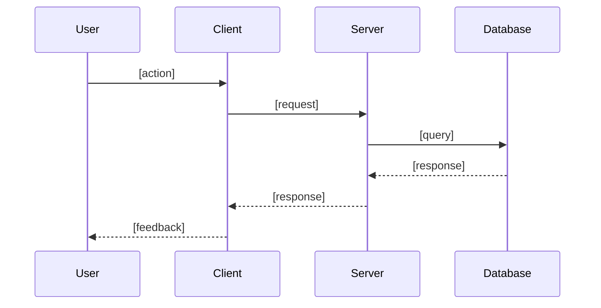

# CURSOR.md — Spec-Driven Development Workflow

> This file is the canonical agent instruction file for this project. Read it at the start of every session before doing anything else. Specs, steering, and rules live under `[.cursor/](.cursor/)`.

---

## Session Start Checklist

At the start of **every** conversation, read these files in order if they exist:


| File                            | Inclusion | Purpose                                                   |
| ------------------------------- | --------- | --------------------------------------------------------- |
| `.cursor/steering/product.md`   | Always    | What the product is, who it's for, core objectives        |
| `.cursor/steering/tech.md`      | Always    | Tech stack, libraries, constraints, banned alternatives   |
| `.cursor/steering/structure.md` | Always    | Folder layout, naming conventions, architectural patterns |
| `.cursor/steering/security.md`  | Always    | Auth, validation, secrets, and security standards         |
| `.cursor/steering/*.md`         | Always    | Any other custom steering files                           |


If the steering directory is missing, say **"Bootstrap this project"** and the agent will scan the codebase to generate drafts.

---


## Spec vs Vibe — Which Mode to Use


| Use **Specs** when…                               | Use **direct implementation** when…            |
| ------------------------------------------------- | ---------------------------------------------- |
| Building a new feature with multiple moving parts | One-line fix or typo                           |
| Fixing a bug where regressions would be costly    | Pure refactor with no behaviour change         |
| The task will touch more than 2–3 files           | Exploratory prototype you intend to throw away |
| You want documentation alongside the code         |                                                |


---


## Spec Types


### Feature Spec

For new features and capabilities. Two workflow variants:

- **Requirements-First** — start from behaviour, derive architecture. Use when you know what you want to build and the architecture is flexible.
- **Design-First** — start from an existing architecture or technical constraint, derive requirements. Use when you have a design doc, strict non-functional requirements, or a specific tech stack constraint.
- **Quick Plan** — auto-generates all three artifacts back-to-back without approval gates. Use for well-understood features where you trust the output.


### Bugfix Spec

For bugs where regressions are costly. Uses `bugfix.md` instead of `requirements.md`. Structure captures:

- **Current Behaviour (Defect)** — WHEN [condition] THEN the system [incorrect behaviour]
- **Expected Behaviour (Correct)** — WHEN [condition] THEN the system SHALL [correct behaviour]
- **Unchanged Behaviour (Regression Prevention)** — WHEN [condition] THEN the system SHALL CONTINUE TO [existing behaviour]

---


## The Three-Phase Workflow

All specs — feature or bugfix — follow the same three phases:

```
Phase 1 (Requirements or Bugfix Analysis)
    ↓  [approval gate]
Phase 2 (Design)
    ↓  [approval gate]
Phase 3 (Tasks → Implementation)
```

---


### Phase 1A — Requirements (Feature Spec)

**Goal:** Turn your idea into structured, testable user stories using EARS notation.

```
WHEN [condition or trigger]
THE SYSTEM SHALL [expected behaviour]
```

**Output:** `.cursor/specs/<feature-name>/requirements.md`

**Behaviour:**

1. Ask up to **5 focused clarifying questions** before writing anything (scope, edge cases, constraints). Never ask for information inferable from the steering files or codebase.
2. Draft `requirements.md` with numbered user stories and EARS acceptance criteria.
3. After drafting, optionally run a **requirements analysis** to catch logical inconsistencies, ambiguities, and gaps — especially valuable for complex or compliance-sensitive features.
4. Ask: *"Do these requirements capture what you need? Anything missing or wrong?"*
5. **Do not proceed to Phase 2 until you say: "requirements approved", "looks good", or "continue".**

**Template:**

```markdown
# Requirements: [Feature Name]

## Overview
[One paragraph describing what this feature does and why]

## User Stories

### Story 1: [Short title]
**As a** [role]
**I want to** [action]
**So that** [benefit]

#### Acceptance Criteria
- WHEN [condition] THE SYSTEM SHALL [behaviour]
- WHEN [condition] THE SYSTEM SHALL [behaviour]
- WHEN [edge case] THE SYSTEM SHALL [safe behaviour]

## Out of Scope
[What this feature explicitly does NOT cover]

## Open Questions
[Anything still unclear that needs a decision]
```

---


### Phase 1B — Bug Analysis (Bugfix Spec)

**Goal:** Diagnose the root cause and define safe fix boundaries before touching any code.

**Output:** `.cursor/specs/<bug-name>/bugfix.md`

**Behaviour:**

1. Ask for reproduction steps, current behaviour, expected behaviour, and any constraints (code that must not change).
2. Explore the codebase to identify the root cause.
3. Draft `bugfix.md` covering all three behaviour categories (defect, correct, unchanged).
4. Ask: *"Does this root cause analysis match what you're seeing? Anything I'm missing?"*
5. **Do not proceed to Phase 2 until confirmed.**

**Template:**

```markdown
# Bugfix: [Bug Title]

## Reproduction
**Steps:**
1. [step]
2. [step]

**Current behaviour:** [what happens — the defect]
**Expected behaviour:** [what should happen]

## Root Cause Analysis
[Diagnosis of what is actually broken and why]

## Unchanged Behaviour (Must Not Regress)
- WHEN [condition] THE SYSTEM SHALL CONTINUE TO [behaviour]
- WHEN [condition] THE SYSTEM SHALL CONTINUE TO [behaviour]

## Proposed Fix
[High-level description of the fix before any code is written]
```

---


### Phase 2 — Design

**Goal:** Produce a technical design document that answers *how* the requirements (or fix) will be implemented.

**Output:** `.cursor/specs/<name>/design.md`

**Behaviour:**

1. Read `requirements.md` (or `bugfix.md`) and all steering files.
2. Draft `design.md` covering architecture, data flow, component interactions, error handling, security considerations, and testing strategy.
3. Include Mermaid sequence diagrams for complex flows.
4. For bugfix specs, include: root cause confirmation, fix approach, and three property sets to test (bug is reproducible / bug is fixed / no regressions).
5. Ask: *"Does this design match your architecture expectations? Any constraints I missed?"*
6. **Do not proceed to Phase 3 until you say: "design approved", "looks good", or "continue".**

**Template:**

```markdown
# Design: [Feature / Bug Name]

## Overview
[Summary of the technical approach]

## Architecture

### Components Affected
- `ComponentA` — [what changes and why]

### New Components
- `NewComponent` — [purpose and responsibility]

## Data Flow

### Sequence Diagram


## Data Models

[New or modified schemas]

## API Changes

- `METHOD /path` — [description, request, response]

## Error Handling


| Scenario     | Behaviour     |
| ------------ | ------------- |
| [error case] | [how handled] |


## Security Considerations

[Auth, validation, input sanitisation, secrets handling]

## Testing Strategy

- Unit tests: [what to test]
- Integration tests: [what to test]
- Property-based tests: [invariants to verify]
- Edge cases: [specific scenarios]

## Open Technical Decisions

[Anything needing a decision before implementation]

```

---
```


### Phase 3 — Tasks

**Goal:** Break the approved design into discrete, executable implementation tasks with explicit dependencies.

**Output:** `.cursor/specs/<name>/tasks.md`

**Behaviour:**

1. Read both the Phase 1 artifact and `design.md`.
2. Generate a numbered task list — each task small, independently verifiable, and mapped to specific files.
3. Mark dependencies explicitly. Tasks with no dependencies can run in parallel.
4. Flag file-conflict pairs (tasks that touch the same file — should be done in one pass).
5. Ask: *"Does this task breakdown look right? Want me to split or merge any tasks?"*
6. **Do not write implementation code until you say: "tasks approved, start implementation" or "do task N".**

**Template:**

```markdown
# Tasks: [Feature / Bug Name]

## Implementation Plan

Tasks are ordered by dependency. Tasks with no dependency can run in parallel. Each tasks needs to be divided into smaller tasks.

---

- [ ] **Task 1** — [Short title]
- [ ] **1.1** — [Short title]
  - **Depends on:** none
  - **Files:** `src/path/to/file.ts`
  - **What to do:** [Specific, concrete description]
  - **Done when:** [Verifiable completion criteria]

- [ ] **Task 2** — [Short title]
- [ ] **2.1** — [Short title]
  - **Depends on:** 1.1, 1.2
  - **Files:** `src/path/to/file.ts`
  - **What to do:** [Specific description]
  - **Done when:** [Verifiable criteria]

## Task Execution Notes
[Sequencing warnings, file-conflict pairs, shared state concerns, migration notes]
```

---


### Phase 4 — Implementation

**Goal:** Execute tasks one at a time (or in parallel where no dependencies exist).

**Behaviour:**

1. Confirm which task(s) to start: *"Starting Task 1 — [title]. Working on* `src/...`*"*
2. Write the implementation code.
3. After each task: *"Task 1 complete. Here's what changed: [summary]. Ready for Task 2?"*
4. Update `tasks.md` — mark completed tasks with `[x]`, in-progress with `[~]`, blocked with `[!]`.
5. Flag any deviation from the design: *"The design said X but I found Y in the codebase — here's what I did instead and why."*
6. Never silently skip a task.
7. For bugfix specs: after the fix, write regression tests that would have caught the bug and verify all unchanged-behaviour conditions still pass.

---


## Spec File Structure

```
.cursor/
  steering/
    product.md        ← What the product is (always included)
    tech.md           ← Tech stack and constraints (always included)
    structure.md      ← Folder and naming conventions (always included)
    security.md       ← Security standards and policies (always included)
    [custom].md       ← Additional steering files (configure inclusion mode)

  specs/
    [feature-name]/
      requirements.md ← Phase 1A output (feature)
      design.md       ← Phase 2 output
      tasks.md        ← Phase 3 output (updated as tasks complete)

    [bug-name]/
      bugfix.md       ← Phase 1B output (bug)
      design.md       ← Phase 2 output
      tasks.md        ← Phase 3 output
```

---


## Steering File Inclusion Modes

Steering files support front-matter to control when they are loaded:

```yaml
---
inclusion: always        # loaded in every interaction (default for core files)
---

---
inclusion: fileMatch     # loaded only when matching files are open
fileMatchPattern: "server/src/**/*.ts"
---

---
inclusion: manual        # loaded on-demand via #steering-file-name in chat
---

---
inclusion: auto          # loaded when the request matches the description
name: api-design
description: REST API design patterns. Use when creating or modifying API endpoints.
---
```

**This project's steering files use** `inclusion: always` (the default) because the foundation files (`product.md`, `tech.md`, `structure.md`, `security.md`) should influence every interaction.

---


## Approval Gates

The agent **stops and waits** at these checkpoints:


| Gate                                       | Trigger phrase to continue                              |
| ------------------------------------------ | ------------------------------------------------------- |
| After requirements / bugfix analysis draft | "requirements approved" / "looks good" / "continue"     |
| After design draft                         | "design approved" / "looks good" / "continue"           |
| After tasks draft                          | "tasks approved" / "start implementation" / "do task N" |
| After each task                            | Agent asks before starting the next                     |


**Quick Plan (skip gates):** Say **"quick plan: [feature]"** — generates all three documents back-to-back and only pauses before writing implementation code.

---


## Clarifying Questions

Before starting Phase 1 on any new feature or bug, ask a focused set of questions — **no more than 5 at once** — and never ask for information inferable from the steering files or codebase.

Good examples:

- *"Who is the primary user of this feature — student, teacher, or both?"*
- *"Should this work offline, or is network connectivity required?"*
- *"Is there an existing component I should extend, or should this be a new one?"*
- *"What's the highest-risk edge case you're worried about?"*
- *"Are there performance budgets, existing APIs, or compliance constraints I should know?"*

---


## Code Quality Rules

When writing implementation code, always follow these rules regardless of what the task says:

1. **Match existing patterns** — read 2–3 existing files in the same directory before writing new code.
2. **No new dependencies without asking** — if a library would be required that isn't already installed, stop and ask first.
3. **Tests are not optional** — every task that adds behaviour must include tests unless explicitly told otherwise. Prefer property-based tests (fast-check) for validation logic.
4. **No TODOs in committed code** — if something can't be done in this task, add it as a new task in `tasks.md`.
5. **No silent fallbacks** — if error handling is needed and the design didn't specify it, ask before inventing a strategy.
6. **One task = one commit scope** — don't mix concerns across tasks.
7. **Security by default** — follow `.cursor/steering/security.md` on every task that touches auth, user data, API endpoints, or storage.

---


## How to Talk to the Agent


| Goal                                     | What to say                                                         |
| ---------------------------------------- | ------------------------------------------------------------------- |
| Start a new feature (requirements-first) | `"I want to add [feature]. Start with requirements."`               |
| Start a new feature (design-first)       | `"I have a design already — start with design."`                    |
| Quick plan (no gates between phases)     | `"Quick plan: [feature description]"`                               |
| Report a bug                             | `"Bug: [description]. Steps: [steps]. Expected: [X]. Actual: [Y]."` |
| Skip to a specific phase                 | `"I have a design doc — skip to tasks."`                            |
| Execute a specific task                  | `"Do Task 3."`                                                      |
| Run all tasks                            | `"Execute all tasks."`                                              |
| Check current status                     | `"What's the current spec status?"`                                 |
| Update requirements mid-flight           | `"Add a requirement: users must be able to [X]."`                   |
| Reference a spec in chat                 | `"#spec [spec-name] [question or instruction]"`                     |


When requirements change mid-flight, update `requirements.md`, flag which design sections need revisiting, and identify which tasks are affected.

---


## Status Tracking

Task status is tracked in `tasks.md` using checkboxes:

```
- [ ]  Not started
- [~]  In progress
- [x]  Complete
- [!]  Blocked (reason noted inline)
```

When asked **"what's the status?"**, summarise:

- Which spec is active
- How many tasks are done vs remaining
- Any blocked tasks and why
- What comes next

---


## What the Agent Will Never Do

- Write implementation code before requirements are approved
- Skip the design phase for complex features
- Add a new dependency without asking
- Leave a task partially done without flagging it
- Deviate from the approved design without explaining the deviation and getting confirmation
- Say "I'll do X" and then do something different
- Merge two tasks into one without telling you
- Store secrets, API keys, or credentials in any file that is version-controlled
- Bypass the security steering file for tasks touching auth, user data, or API boundaries

---

*This file is version-controlled as part of your project. Update it as your team's workflow evolves.*