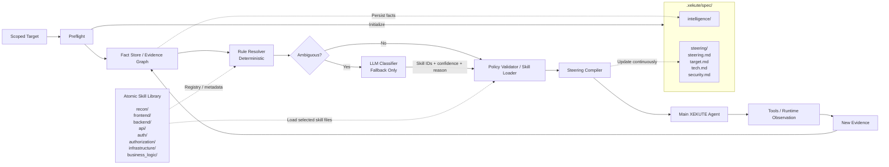

# XEKUTE Adaptive Skill & Steering Pipeline



## Flow Summary

```text
Scoped Target
    ↓
Preflight
    ├── discovers tech stack, host, DNS, IP, app type, API type
    ├── initializes .xekute/spec/
    └── writes normalized findings into intelligence
    ↓
Fact Store / Evidence Graph
    ↓
Deterministic Rule Resolver
    ↓
Is the skill mapping obvious?
    ├── YES → select matching skill IDs
    └── NO  → LLM Classifier
                  ↓
            skill IDs
            confidence
            reason
                  ↓
Policy Validator / Skill Loader
    ↓
Load relevant atomic skill files
    ↓
Steering Compiler
    ├── target.md
    ├── tech.md
    ├── security.md
    └── steering.md
    ↓
Main XEKUTE Agent
    ↓
Tools / Runtime Observation
    ↓
New Evidence
    ↓
Fact Store / Evidence Graph
    ↓
Re-resolve skills when meaningful facts change
    ↓
Recompile steering
    ↓
Continue assessment
```

## Core Runtime Principle

```text
Atomic Skill Files
        │
        │ permanent methodology knowledge
        ▼
Skill Resolver
        │
        │ selects relevant knowledge
        ▼
Steering Compiler ◄──────── Target Intelligence
        │
        ▼
Dynamic Steering Files
        │
        ▼
Main Agent
        │
        ▼
New Evidence
        │
        └──────────────► Target Intelligence
```

## Responsibility Boundaries

| Component | Responsibility |
|---|---|
| **Preflight** | Determine what the scoped target technically is. |
| **Fact Store / Evidence Graph** | Durable source of truth for evidence-backed target knowledge. |
| **Rule Resolver** | Deterministically map obvious facts to relevant skill IDs. |
| **LLM Classifier** | Resolve ambiguous skill-selection cases only. |
| **Policy Validator / Skill Loader** | Validate requested skills and load only approved files. |
| **Atomic Skill Library** | Permanent methodology knowledge grouped by technology/security domain. |
| **Steering Compiler** | Merge relevant skills with current target facts into compact working context. |
| **`target.md`** | Current model of the application, services, roles, resources, and boundaries. |
| **`tech.md`** | Current model of technologies, infrastructure, protocols, APIs, and hosting. |
| **`security.md`** | Current model of authentication, authorization, trust boundaries, controls, and security-relevant observations. |
| **`steering.md`** | Current priorities, active methodology, unknowns, constraints, and investigation direction. |
| **Main XEKUTE Agent** | Execute the assessment while following current steering. |
| **Runtime Observation** | Produce new evidence through tools and target interaction. |

## Skill Resolution Policy

```text
HIGH-CONFIDENCE MATCH
        ↓
Deterministic activation

AMBIGUOUS MATCH
        ↓
LLM classifier
        ↓
Policy validation
        ↓
Activation / rejection

LOW-CONFIDENCE OR IRRELEVANT
        ↓
Do not load
```

## Continuous Update Loop

```text
New observation
      ↓
Meaningful new information?
   ┌──┴──┐
   │     │
  No    Yes
   │     │
   │     ▼
   │  Normalize fact
   │     ↓
   │  Attach evidence + confidence
   │     ↓
   │  Update intelligence
   │     ↓
   │  Does it affect methodology?
   │       ┌──┴──┐
   │       │     │
   │      No    Yes
   │       │     │
   │       │     ▼
   │       │  Re-run skill resolver
   │       │     ↓
   │       │  Load/unload skills
   │       │     ↓
   │       └──► Recompile affected steering files
   │                 ↓
   └──────────────► Continue assessment
```

> **Methodology adapts as target knowledge grows.**

The fact store is the source of truth.  
Atomic skills are the methodology source of truth.  
Steering files are disposable, continuously updated working memory for the agent.
