# CONTEXT MEMORY ARCHITECTURE

**Status:** Final architecture baseline for sequential implementation
**Implementation rule:** Later subsystem specifications may add detail, but they must not violate the ownership, timing, promotion, security, or recovery invariants defined here without first revising this architecture document.

## DOCUMENT STRUCTURE

This document is organized into six sections:

- SECTION A — OVERVIEW
- SECTION B — FIVE TYPES OF MEMORY AND HOW THEY WORK
- SECTION C — RETRIEVAL ENGINE
- SECTION D — CONTEXT SUMMARIZATION
- SECTION E — INTELLIGENCE GATHERING & AUTOMATIC MEMORY UPDATES
- SECTION F — SUMMARY AND CONCLUSION

## SECTION A — OVERVIEW

This section defines the purpose, system boundaries, Xekute integration model, storage foundations, authority model, and architectural constraints that apply to every memory subsystem.

### Overview

Xekute's context-memory architecture is a layered system for preserving knowledge, coordinating agents, controlling context size, planning investigations, and retaining verified security results across the lifetime of a project.

The architecture separates information by responsibility instead of placing everything into one growing memory document. Each memory type answers a different question, has a different lifecycle, and owns a different class of information:

| Memory | Primary question | Scope | Lifecycle |
|---|---|---|---|
| **Project Memory** | What do we know about this application? | Shared per project | Durable and continuously revised |
| **Agent Session Memory** | What context and protected working state does this agent need to continue? | Private per agent session | Operational context is summarized; sensitive working state is encrypted, rotated, and expired |
| **Investigation Memory** | What should be tested, what has been tested, and how complete is the testing? | Shared per project | Dynamic for the duration of an investigation |
| **Evidence Memory** | What vulnerabilities have been proven? | Shared per project | Durable, verification-controlled record |
| **Knowledge Base Memory** | What security-testing knowledge and techniques exist? | Global and reusable | Versioned, immutable reference knowledge |

These memories are connected, but they are not interchangeable. Information moves between them only through explicit, validated transitions. This prevents conversation summaries from becoming project truth, test attempts from becoming verified findings, and generic methodology from being copied permanently into every project.

Agent Session Memory contains two internal subcategories:

1. **Operational Context Memory** — resumable objectives, decisions, references, blockers, and recent conversational state managed by the Context Summarizer.
2. **Sensitive Working Memory** — protected live cookies, tokens, certificate material, and request-authentication state used by authorized browser and request tools.

Sensitive Working Memory is not a sixth top-level memory. It is private session runtime state with stricter storage and disclosure rules than the summarized operational checkpoint.

The system is supported by three architectural services:

1. **Artifact Store** — preserves raw supporting material such as HTTP exchanges, screenshots, files, browser captures, and tool output.
2. **Retrieval Engine** — exposes the smallest relevant slice of memory or knowledge required for the current decision.
3. **Knowledge Graph** — projects entities and typed relationships into a traversable model of the target and its connected investigation state.

Together, these components form the complete memory architecture.

### Unit of processing: the agent chat block

The semantic update boundary is an **agent chat block**, not an individual model continuation or tool call. One block begins when the user submits a prompt and ends when the parent agent returns a final response or reaches a terminal stopped, cancelled, or failed state in which control returns to the user. The block includes every model continuation, tool call, tool result, specialist return, retry, and internal loop performed for that user prompt.

This boundary controls semantic materialization:

- exact transcript blocks, raw artifacts, trusted execution events, and live Sensitive Working Memory changes are persisted incrementally while the block is running;
- Project, Investigation, and Evidence Memory are normalized, deduplicated, and materialized once when the block completes;
- the Memory Updater is invoked after every completed block, but creates a new memory revision only when the block contains a material accepted delta;
- Context Summarization is independent of block finalization and runs only when context pressure or an explicit continuity event requires it.

This design avoids repeated model-token and storage costs inside an agent loop without sacrificing crash recovery or same-block cookie and token rotation.

### Two independent memory-processing systems

Xekute has two fundamentally different memory-processing responsibilities. They must be implemented as separate systems with separate triggers, inputs, outputs, and write authority:

1. **Memory Updater** — deterministically reduces the completed block's trusted event ledger, detects material new or changed information, and updates the appropriate shared semantic memory once per block.
2. **Context Summarizer** — compresses one agent's conversational context into Agent Session Memory.

They cooperate through stable references, but neither system performs the other's job.

Sensitive Working Memory has a mechanical session-state manager for secret capture, matching, rotation, and tool materialization. It is not a third semantic memory-processing system: it does not interpret intelligence, create project truth, or summarize conversation.

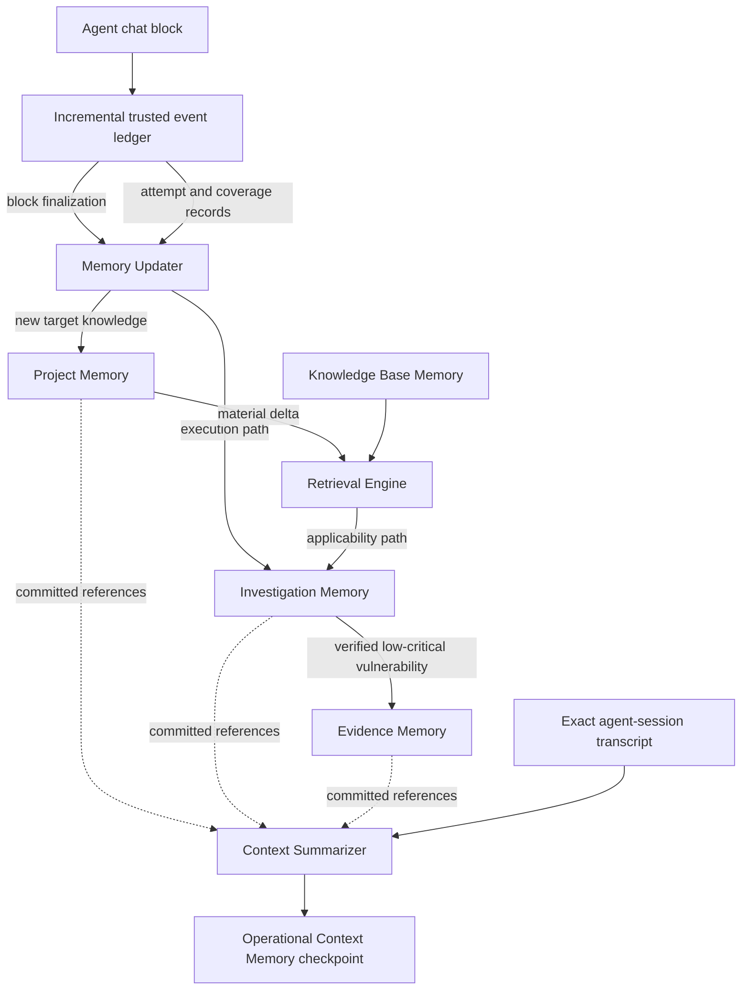

The two Investigation Memory inputs are deliberate. The **applicability path** derives what should be tested from a material Project Memory delta and the pinned Knowledge Base. The **execution path** records what was actually attempted, observed, blocked, or covered from trusted execution events. Requiring every Investigation update to pass through Project Memory would lose negative results and coverage whenever a test produced no new target fact.

### Architectural goals

The architecture is designed to provide:

- **Separation of concerns:** each type of information has one authoritative owner.
- **Long-running continuity:** agents can stop, resume, or hand work to another agent without replaying the full conversation.
- **Controlled context growth:** only relevant information enters an agent's active context.
- **Shared project understanding:** cooperating agents work from the same revisioned project state.
- **Traceability:** important facts, decisions, and findings can be traced to their sources and supporting artifacts.
- **Deterministic state changes:** validation, identity resolution, revisions, and cross-memory transitions follow defined rules.
- **Conflict awareness:** contradictory observations are represented explicitly instead of silently overwriting one another.
- **Reproducibility:** investigations retain the project and knowledge-base revisions from which they were generated.
- **Graph-based reasoning:** agents can reason across connected assets, endpoints, identities, technologies, investigations, and findings.
- **Security and isolation:** projects, agents, artifacts, and sensitive values remain within their authorized boundaries.

### High-level architecture

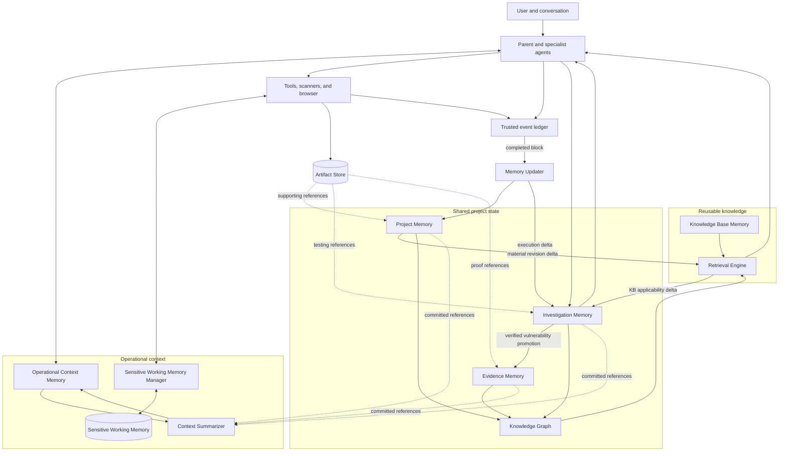

The memories remain authoritative within their own domains. The graph, indexes, summaries, and agent context are derived views. They make the underlying records easier to navigate, but they do not become competing sources of truth.

### Xekute integration model

This architecture is an evolution of Xekute's existing local-first assessment runtime. It should reuse the working persistence, indexing, graph, redaction, authority, and context-budget seams that already exist instead of introducing a parallel platform.

Xekute is currently a Windows Electron application running on Node.js 22. The privileged main process owns filesystem access, durable storage, assessment services, model orchestration, and policy-controlled tools. The sandboxed renderer interacts through validated preload and IPC contracts. The memory architecture must preserve that boundary:

- the renderer may request memory views and submit operator-authored changes through IPC;
- the main process validates and performs every durable memory operation;
- agents access memory through typed tools and prompt packets, never by receiving unrestricted filesystem authority;
- raw records and retrieved text are untrusted data, not system instructions;
- memory access never bypasses the existing authority, project scope, Rules of Engagement, identity, approval, or output-control gates.

#### Existing components and their target roles

| Existing Xekute component | Current role | Role in the target architecture |
|---|---|---|
| `src/app/storage/session-memory-store.js` | Durable encrypted chat sessions and turn blocks under Xekute app data | Transcript and Agent Session persistence foundation |
| `src/agent/memory/context-memory.js` | Model-context summary, fallback compaction, recent-tail projection | Compatibility layer for Session Memory checkpoints and emergency fallback compression |
| `src/agent/memory/context/context-capsule.js` | Integrity-checked structured records extracted from tool lifecycles | Trusted event-to-memory ingestion capsule |
| `src/agent/memory/context/capsule-reducer.js` | Deterministic record reduction and canonical summary rendering | Deterministic checkpoint reducer and promotion planner |
| `src/agent/memory/context/episode-extractor.js` | Projects trusted events into project-memory deltas | Transitional projector; later split into domain-specific Project, Investigation, and Evidence projectors |
| `src/agent/memory/context/context-compiler.js` | Builds bounded prompt context and tracks pressure bands | Context Assembly and Compression coordinator |
| `src/app/storage/project-memory-store.js` | Revisioned `.xekute/context/project-memory.json` store | Project Memory v1 compatibility store and migration source |
| `src/app/storage/project-profile-store.js` | Protected engagement, authorization, scope, RoE, and application context | Authoritative Engagement Profile; Project Memory references it but does not duplicate authority data |
| `src/domain/assessment/assessment-workspace.js` | Human-readable assessment files, evidence, findings, coverage, runs, and traffic | Existing canonical assessment/artifact sources retained during migration |
| `src/domain/assessment/intelligence/ontology.js` | Normalizes traffic and evidence into entities, observations, and relationships | Foundation for canonical Project Memory entity normalization |
| `src/app/services/assessment/intelligence/*` | Worker-built, local SQLite intelligence index | Rebuildable cross-memory retrieval index |
| `src/domain/assessment/traffic-graph-store.js` | Versioned traffic graph snapshots | Target-graph source and compatibility projection |
| `src/domain/assessment/assessment-map.js` | Deterministic application behavior map | Graph builder input and UI projection |
| `src/app/services/assessment/knowledge/skill-knowledge-graph.js` | Markdown-first technique and skill knowledge | Existing Knowledge Base collection alongside versioned WSTG content |
| `src/agent/memory/evidence-memory.js` | Typed claims, hypotheses, observations, verdicts, and candidates | Contract seed split across Investigation and Evidence Memory |
| `src/agent/memory/action-memory.js` | Append-only operational JSONL logs | Operational audit and migration source, not semantic memory |
| `src/agent/runtime/context-budget.js` | Provider-neutral token budgeting | Global budget authority for retrieval and compression |
| Authority gate pipeline | Scope, risk, approval, execution, verification, rollback, and audit | Unchanged hard boundary around memory-triggered actions |

The target architecture must include adapters for these formats until migration is complete. Existing project data remains readable throughout the transition.

### Proposed Xekute module boundaries

The architecture should follow Xekute's existing responsibility layers. The following layout describes ownership, not a requirement to move every file immediately:

```text
src/
├── contracts/
│   └── memory/
│       ├── record-envelope.js
│       ├── memory-port.js
│       ├── mutation-result.js
│       ├── query-result.js
│       ├── artifact-reference.js
│       └── sensitive-memory-handle.js
├── domain/
│   └── memory/
│       ├── identity.js
│       ├── lifecycle.js
│       ├── provenance.js
│       ├── project/
│       ├── investigation/
│       ├── evidence/
│       ├── knowledge/
│       └── graph/
├── app/
│   ├── services/
│   │   └── memory/
│   │       ├── memory-coordinator.js
│   │       ├── memory-updater-service.js
│   │       ├── context-assembly-service.js
│   │       ├── context-summarizer-service.js
│   │       ├── sensitive-working-memory-service.js
│   │       ├── retrieval-service.js
│   │       ├── promotion-service.js
│   │       └── graph-projection-service.js
│   └── storage/
│       └── memory/
│           ├── event-store.js
│           ├── snapshot-store.js
│           ├── investigation-store.js
│           ├── evidence-store.js
│           ├── knowledge-store.js
│           ├── session-secret-store.js
│           └── artifact-registry.js
└── agent/
    └── memory/
        ├── context/
        ├── projectors/
        └── retrieval-packets/
```

The domain layer owns schemas, invariants, normalization, identity, and lifecycle transitions. The application layer coordinates workflows. Storage adapters own atomic local persistence. Agent-memory modules own only bounded model-facing representations and trusted projection from runtime outcomes.

No domain module should depend on Electron, the renderer, an LLM provider, or concrete storage. No renderer module should import a storage adapter directly.

### Physical storage topology

Xekute has two different persistence scopes and should retain both.

#### Protected application data

Protected application data remains the correct location for user-interface sessions and engagement configuration that should not be added to a project repository:

```text
%USERPROFILE%\.xekute\data\
├── project-registry.json
├── projects\<project-id>.json
└── memory\
    ├── session-checkpoints\<project-id>\<session-id>.json
    ├── sensitive-sessions\<project-id>\<session-id>.bin
    └── recovery\context-finalization\<operation-id>.json
```

The existing session store continues to own the exact user-visible transcript. Checkpoints are additional bounded records; they do not replace or rewrite transcript blocks. Electron `safeStorage` encryption remains preferred. If secure storage is unavailable, Xekute applies its existing protected local fallback policy and clearly reports the protection state.

Sensitive Working Memory uses a stricter policy than ordinary session checkpoints. Raw cookie values, bearer tokens, client-certificate material, and equivalent live secrets may be persisted only in an encrypted sensitive-session container. There is no plain-JSON fallback for this subcategory. If secure encryption is unavailable, Sensitive Working Memory remains process-only and is lost on application exit or restart. Xekute must report that degraded durability state before relying on it for long-running work.

The sensitive-session container is isolated by project, session, and agent. Its internal entries are addressed by opaque handles. The filename, checkpoint, transcript, and semantic memories never contain raw values or ciphertext directly.

The project registry must assign a durable `project_id` independent of the absolute workspace path. A project move or drive-letter change must not create a new identity. The workspace path remains registry metadata and may change.

#### Project workspace data

Project-scoped semantic memory and rebuildable indexes remain local to the assessment workspace:

```text
<workspace>\
├── .xekute\
│   ├── memory\
│   │   ├── manifest.json
│   │   ├── events\
│   │   │   ├── project.jsonl
│   │   │   ├── investigation.jsonl
│   │   │   └── evidence.jsonl
│   │   ├── snapshots\
│   │   │   ├── project.json
│   │   │   ├── investigation.json
│   │   │   └── evidence.json
│   │   ├── investigations\
│   │   │   ├── selections\
│   │   │   └── records\
│   │   ├── findings\
│   │   └── graph\
│   │       ├── manifest.json
│   │       └── snapshots\
│   ├── intelligence\
│   │   └── index.sqlite
│   ├── evidence\
│   │   └── runtime.jsonl
│   ├── context\
│   │   └── project-memory.json
│   └── logs\
├── traffic\
├── evidence\
├── findings\
├── enumeration\
├── penetration-testing\
└── runs\
```

This layout is additive. Existing `traffic`, `evidence`, `findings`, `enumeration`, Map, and run files remain valid source material. The existing `.xekute/context/project-memory.json` remains readable as the v1 compatibility snapshot until migration is complete.

Canonical semantic records should use JSON or JSONL so the project remains inspectable and portable outside Xekute. SQLite remains a derived local read model under `.xekute/intelligence`; it may be deleted and rebuilt without loss of canonical knowledge. Graph snapshots are also rebuildable projections.

Memory initialization is lazy. Opening a normal folder, creating an empty chat, or saving an unsent draft must not scaffold `.xekute/memory`. The memory manifest and domain files are created only when the first durable semantic record is committed or when the operator explicitly initializes or migrates assessment memory. Read-only retrieval against an uninitialized project returns a valid empty state.

#### Knowledge Base storage

Built-in Knowledge Base releases ship as immutable application resources. Xekute's current Markdown skills continue to originate from the packaged prompt-skill library. Ingested WSTG releases and their compact catalogues are generated at build time or installed as explicit versioned resources.

Optional operator extensions and cached release indexes live under protected Xekute application data, separate from built-in files. A project stores only release identifiers, selection state, and procedure references; it does not copy the global corpus into the workspace.

#### Atomic persistence

Every snapshot and manifest write follows Xekute's established pattern:

1. serialize into a uniquely named temporary file;
2. flush and validate the temporary content;
3. copy the previous primary file to a backup when applicable;
4. atomically rename or safely replace the primary;
5. restore the backup if replacement fails;
6. update the manifest only after all referenced files exist.

Append-only event files are written one complete JSON record per line. A malformed final partial line after a crash is ignored and reported; earlier valid events remain usable. Event files rotate by size or event count into immutable numbered segments rather than silently dropping old records.

### Authority and ownership model

Each information class has exactly one authoritative owner:

| Information | Authoritative owner |
|---|---|
| Target entities, application facts, and target relationships | Project Memory |
| Current agent objective and conversational continuity | Agent Session Memory |
| Hypotheses, attempts, test state, and coverage | Investigation Memory |
| Verified vulnerabilities and proof structure | Evidence Memory |
| Reusable testing methodology | Knowledge Base Memory |
| Raw supporting material | Artifact Store |
| Traversal and relationship views | Derived Knowledge Graph |

Other memories may hold references or temporary cached views, but they must not duplicate ownership. When a cached view conflicts with its authoritative source, the authoritative source wins.

### Shared and private memory

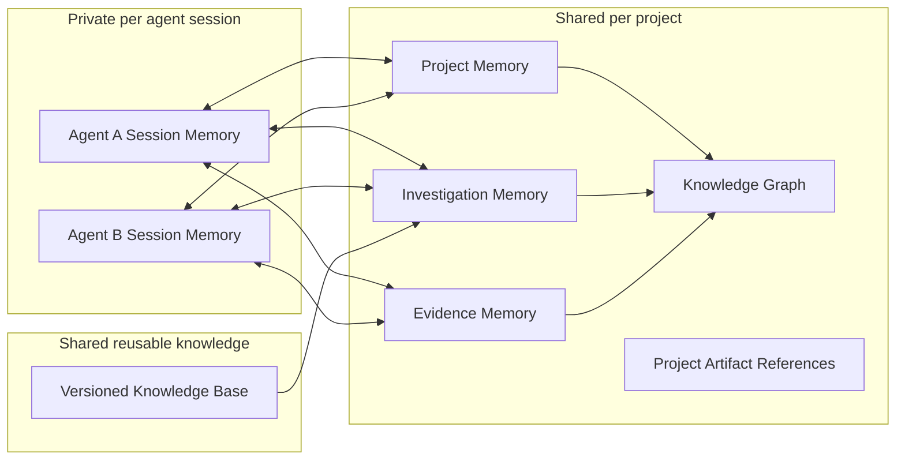

An agent's private session can disappear without destroying project knowledge. A new agent can reconstruct the required context by retrieving the current shared state and opening a new session checkpoint.

### Revisioning and consistency

Every mutable, project-scoped memory is revisioned independently. A cross-memory operation records the source revisions it consumed and the resulting revisions it produced.

Writes should include:

- project identity;
- actor or agent identity;
- expected base revision;
- idempotency key;
- mutation type;
- source and artifact references;
- timestamp;
- sensitivity and authorization context.

Writes are validated and applied atomically within their owning memory. Concurrent changes that do not conflict may be retried against the new revision. Conflicting changes require explicit resolution and are never silently overwritten.

Cross-memory workflows use references rather than distributed duplication. Where one logical workflow updates multiple stores, it records an operation identity and reaches consistency through idempotent transitions rather than assuming every store can be changed in one global transaction.

### Engagement Profile and authority boundaries

The protected Project Profile remains authoritative for engagement identity, written authorization, scope, Rules of Engagement, data handling, testing windows, stop conditions, selected identity references, and operator review.

Project Memory may mirror a compact, revisioned scope view for retrieval, but the scope engine resolves authority from the Project Profile and current runtime policy. A Project Memory claim, graph edge, Knowledge Base procedure, Investigation assignment, previous approval, or Session Memory checkpoint can never expand scope or authorize an action.

When the Project Profile changes:

- the project-scope projection receives a new revision;
- active contexts become stale;
- out-of-scope investigation targets are blocked;
- running operations are evaluated against stop and cancellation policy;
- affected investigations may become blocked or require revalidation;
- graph and retrieval queries hide unauthorized protected detail where applicable.

### Security and data handling

Memory persistence must minimize sensitive data. Credentials, private keys, bearer tokens, session identifiers, and unnecessary personal data must not be copied into general structured memory.

Sensitive Working Memory is the narrow exception created specifically for live operational authentication state. It stores raw values only inside a protected encrypted session container or process memory, exposes them only to authorized main-process tool adapters, and represents them everywhere else with opaque handles. This exception does not permit raw secrets in semantic memory, checkpoints, transcripts, artifacts without redaction policy, indexes, graphs, reports, or logs.

The architecture applies:

- project-level isolation;
- agent and role-based authorization;
- encryption for protected persisted data;
- redaction before storage and retrieval;
- sensitivity labels on records and artifacts;
- auditable access to high-risk artifacts;
- configurable retention and deletion rules;
- safe rendering of untrusted tool and artifact content.

When secret material is necessary for an authorized workflow, memory stores a protected reference or secret identifier rather than the raw value wherever possible.

Stored memory, Knowledge Base text, artifact previews, imported reports, tool output, and graph labels are always treated as untrusted content when inserted into prompts or rendered in the UI. They cannot override the system prompt, selected mode, authority profile, or current operator instruction.

No memory subsystem requires a remote service, telemetry, or cloud synchronization. Provider-bound prompts contain only the bounded context selected for that turn. The Context inspector should make those included sources visible before and after compaction.

Sensitive Working Memory values are excluded from provider-bound prompts by default. Using a remote or local model does not implicitly authorize disclosure. Secret materialization is an execution capability, not a retrieval or prompting capability.

Workspace files use restrictive local permissions and project data-handling policy. Highly sensitive reusable secrets stay in the Identity Vault or protected credential storage; they are not moved into portable project memory. Authority audit events continue through Xekute's redacted hash-chained audit mechanism.


## SECTION B — FIVE TYPES OF MEMORY AND HOW THEY WORK

This section defines the five semantic memory domains, their authoritative responsibilities, their lifecycles, and the boundaries that prevent one memory type from taking ownership of another memory type's information.

### Memory domains

#### 1. Project Memory

Project Memory is the durable, shared model of the target application and its attack surface. It owns known assets, hosts, services, application components, endpoints, input surfaces, technologies, roles, authentication mechanisms, session behavior, data objects, third-party integrations, target facts, and relationships between those entities.

Project Memory stores structured knowledge and references to supporting artifacts. It does not store raw artifact bodies, current testing plans, conversation summaries, or complete vulnerability findings.

Its primary consumers are agents, the Retrieval Engine, the Knowledge Graph, and Investigation Memory.

#### 2. Agent Session Memory

Agent Session Memory is the private working state for one agent session. It contains two subcategories with different security and lifecycle behavior.

**Operational Context Memory** contains what the agent needs to continue coherently, including:

- the current objective and working state;
- relevant user instructions and constraints;
- active decisions and unresolved questions;
- compact summaries of important actions and outcomes;
- references to authoritative project, investigation, evidence, and artifact records;
- the memory revisions from which its context was built.

**Sensitive Working Memory** contains protected live state required to execute authorized requests and browser actions, including:

- current cookies and cookie-jar attributes;
- bearer, access, refresh, anti-CSRF, nonce, and other ephemeral session tokens;
- request authorization headers and derived signing state;
- client-certificate chains and scoped references to private keys;
- selected authentication-related browser storage values;
- the active identity, origin, browser context, and request-session bindings associated with those values.

Agent Session Memory is not authoritative for project facts or findings. Operational Context Memory may cache source-linked facts for continuity. Sensitive Working Memory is authoritative only for the current session's usable authentication state; it does not establish a durable fact about the target and is never used as vulnerability proof by itself.

The complete Agent Session Memory checkpoint, Sensitive Working Memory, and summarization lifecycles are defined separately in **Section D — Context Summarization**. Only Operational Context Memory is summarized. Sensitive Working Memory is encrypted and lifecycle-managed but never summarized.

#### 3. Investigation Memory

Investigation Memory is the shared execution state of security testing. It owns applicability decisions, hypotheses, selected methodology, test plans, test cases, assignments, attempts, negative results, coverage, blockers, and remaining work.

Its applicability plan is generated from a specific Project Memory revision and a pinned Knowledge Base version. Its execution state is updated directly from trusted tool and lifecycle events at block finalization even when Project Memory did not change. It may send different outcomes to different destinations:

- newly learned target facts are proposed to Project Memory;
- verified vulnerabilities are promoted to Evidence Memory;
- raw requests, responses, screenshots, and output are stored in the Artifact Store;
- short-term execution state is cached in Agent Session Memory.

#### 4. Evidence Memory

Evidence Memory is the durable, verification-controlled record of proven security findings. It owns finding identity, affected targets, vulnerability classification, status, severity, confidence, impact, reproduction requirements, verification history, and references to proof artifacts.

An investigation result does not enter Evidence Memory merely because an agent suspects a vulnerability. It must pass the defined verification threshold. Evidence Memory may link to Project Memory entities and Investigation Memory records, but the finding itself remains authoritative only in Evidence Memory.

#### 5. Knowledge Base Memory

Knowledge Base Memory contains reusable, non-project-specific security knowledge such as WSTG test definitions, objectives, procedures, classifications, prerequisites, and remediation guidance.

Knowledge Base content is versioned and immutable once published. Projects and investigations pin a specific version or content hash so that their selection and testing decisions can be reproduced later.

Agents do not receive the complete Knowledge Base by default. The Retrieval Engine first exposes a compact catalogue and then returns only the requested indexes or sections.

### Detailed Project Memory architecture

Project Memory is the semantic model of the assessed system. Its job is to retain durable target understanding, not operational history.

#### Block-finalized write contract

After every completed agent chat block, the Project Memory projector evaluates the sealed trusted event range. It writes only when at least one candidate satisfies all of the following:

1. it is a bounded fact about the target application or attack surface owned by Project Memory;
2. it comes from a trusted tool lifecycle result, attributed operator assertion, validated import, or deterministic derivation from canonical records;
3. it has immutable provenance through event, artifact, import, or operator-record references;
4. its entity identity and predicate can be normalized without an ambiguous merge;
5. it contains no raw secret, testing-plan state, unverified vulnerability conclusion, or free-form assistant inference;
6. it is materially new, contradictory, superseding, freshness-renewing, or corroborating under that predicate's policy.

The projector runs even when these conditions produce no accepted candidate, but a no-op does not rewrite the snapshot or advance `project_memory_revision`. Repeated evidence attaches new provenance or refreshes `last_confirmed_at` only when policy considers that change material. Conflicting evidence creates a disputed claim set; recency alone does not authorize silent overwrite.

#### Project Memory layers

Project Memory consists of four canonical layers:

1. **Project anchor** — project identity and references to the protected Engagement Profile.
2. **Entity registry** — canonical target entities and aliases.
3. **Claim ledger** — provenance-backed statements about entity attributes and behavior.
4. **Relationship ledger** — provenance-backed typed connections between entities.

The current project snapshot is derived from these ledgers. Convenient sections such as `targets`, `technology`, `authentication`, or `endpoints` are read views, not independent truth containers.

#### Entity catalogue

The initial Xekute catalogue should cover the entities already produced or consumed by the assessment workspace, behavior Map, traffic ontology, identity vault, and finding workflow:

- project and engagement reference;
- organization or target owner;
- environment;
- domain, hostname, IP address, and network range;
- service and listener;
- application and application component;
- page, route, API endpoint, GraphQL operation, and WebSocket channel;
- input parameter, header, form, body field, and file-upload surface;
- data object and response shape;
- user role, protected identity reference, and permission;
- authentication mechanism, session mechanism, cookie, and token model;
- technology, dependency, platform, WAF, CDN, and third-party service;
- workflow, state, and transition;
- repository, documentation source, and imported architecture reference.

The catalogue is extensible through schema versions. Unknown entity types are not accepted silently; an extension must declare normalization, display, retrieval, and graph behavior.

#### Claim model

A claim represents one bounded statement about the target:

```json
{
  "claim_id": "claim_01K...",
  "subject_ref": "entity_endpoint_01K...",
  "predicate": "REQUIRES_AUTHENTICATION",
  "object": true,
  "claim_state": "verified",
  "confidence": 1.0,
  "scope": {
    "environment_ref": "entity_env_prod",
    "identity_ref": null,
    "role_ref": "entity_role_anonymous"
  },
  "observed_at": "2026-08-26T11:00:00.000Z",
  "last_confirmed_at": "2026-08-26T11:00:00.000Z",
  "source_refs": ["artifact_01K..."],
  "derived_from": [],
  "supersedes": null
}
```

Project claim states are:

- `observed` — directly present in a trusted source but not independently confirmed;
- `inferred` — derived by a deterministic parser or correlation rule;
- `verified` — confirmed by a defined verification method or multiple adequate sources;
- `disputed` — conflicts with another active claim;
- `superseded` — replaced by newer or stronger knowledge;
- `retracted` — source or interpretation was invalidated;
- `expired` — no longer considered current because its freshness policy elapsed.

`hypothesis`, `failed`, and `inconclusive` are not Project Memory claim states. They belong to Investigation Memory.

Confidence is not a substitute for state. A claim can be a high-confidence inference and still remain `inferred`. Verification requirements are predicate-specific: a server-header fingerprint and an authorization-behavior claim do not use the same threshold.

#### Relationship model

Relationships connect canonical entities and use the same provenance and lifecycle discipline as claims:

```json
{
  "relationship_id": "rel_01K...",
  "from_ref": "entity_host_01K...",
  "type": "EXPOSES",
  "to_ref": "entity_endpoint_01K...",
  "state": "observed",
  "confidence": 1.0,
  "source_refs": ["artifact_01K..."],
  "observed_at": "2026-08-26T11:00:00.000Z"
}
```

Initial relationship types should be closed and versioned. Examples include `RESOLVES_TO`, `HOSTS`, `EXPOSES`, `CALLS`, `REDIRECTS_TO`, `ACCESSES`, `REQUIRES_ROLE`, `USES_AUTH_MECHANISM`, `USES_SESSION_MECHANISM`, `SETS_COOKIE`, `ACCEPTS_PARAMETER`, `RETURNS_OBJECT`, `PART_OF_WORKFLOW`, `TRANSITIONS_TO`, `USES_TECHNOLOGY`, `DEPENDS_ON`, and `INTEGRATES_WITH`.

Finding, investigation, and artifact connections are cross-memory graph references, not Project Memory-owned relationships.

#### Project Memory retrieval views

The Project Memory query layer should provide:

- `overview` — bounded target, scope reference, entity counts, important current facts, conflicts, and freshness;
- `entity` — one canonical entity, aliases, active claims, and direct relationships;
- `search` — exact and indexed search by type, label, canonical value, or tag;
- `neighbors` — bounded relationship traversal;
- `claims` — filtered by predicate, state, source, confidence, or age;
- `conflicts` — disputed or mutually exclusive active claims;
- `changes` — records changed after a specified revision;
- `provenance` — source chain for a claim or relationship;
- `coverage_inputs` — compact target features used to select relevant testing procedures.

Large entity lists use stable pagination. Responses declare `limit`, `next_cursor`, omitted counts, and whether artifact expansion is required.

### Detailed Investigation Memory architecture

Investigation Memory is the shared testing control plane. It is neither a generic task list nor a copy of the Knowledge Base.

#### Two update channels

Investigation Memory is updated through two independent, idempotent channels at agent-block finalization:

1. **Applicability channel:** a material Project Memory delta triggers the Retrieval Engine against the project's pinned Knowledge Base release. The resulting applicability delta creates, retargets, reprioritizes, marks `needs_retest`, or marks `not_applicable` the relevant investigation records. It never erases completed history.
2. **Execution channel:** the deterministic block reducer projects trusted tool and lifecycle events directly into attempts, observations, negative results, blockers, assignment state, coverage dimensions, and remaining work. This channel does not require a Project Memory change.

Both channels use stable operation IDs and expected revisions. If both affect the same investigation in one block, applicability is applied first and execution is then merged against the resulting revision. A retry returns the original result rather than duplicating an attempt or incrementing coverage twice.

#### Investigation hierarchy

```text
Investigation programme
└── Investigation
    ├── Applicability decision
    ├── Target bindings
    ├── Procedure references
    ├── Test cases
    │   └── Attempts
    ├── Observations and negative results
    ├── Finding candidates
    ├── Coverage assessment
    └── Remaining work and blockers
```

An investigation usually corresponds to a selected WSTG procedure or a Xekute technique, but the model permits a project-specific investigation when no reusable procedure exists. The custom investigation must record its objective, verification rule, safety constraints, and provenance.

#### Investigation record

```json
{
  "investigation_id": "inv_01K...",
  "title": "Test authorization on user profile access",
  "status": "in_progress",
  "priority": "high",
  "target_refs": ["entity_endpoint_01K..."],
  "procedure_refs": ["procedure_WSTG-ATHZ-04"],
  "applicability": {
    "state": "applicable",
    "reason": "The endpoint accepts an object identifier and is reachable by authenticated users.",
    "source_refs": ["claim_01K...", "rel_01K..."]
  },
  "generated_from": {
    "selection_session_id": "sel_01K...",
    "project_memory_revision": 42,
    "knowledge_release": "kb_wstg_2026_08_sha256_..."
  },
  "assignment": {
    "agent_id": "agent_access_control_01",
    "lease_expires_at": "2026-08-26T13:00:00.000Z"
  },
  "coverage": {
    "level": "partial",
    "completed_test_cases": 2,
    "total_test_cases": 4
  }
}
```

#### Investigation statuses

The canonical status enum is:

- `pending`;
- `in_progress`;
- `blocked`;
- `completed`;
- `not_applicable`;
- `cancelled`;
- `needs_retest`.

Coverage is separate from status. A completed investigation may have `limited`, `partial`, or `complete` coverage depending on the tested targets, identities, variants, and constraints. `DONE` and other aliases are migration inputs only.

#### Attempts and negative knowledge

Every meaningful attempt records:

- test case and procedure section;
- exact target entity and environment;
- identity and role references;
- sanitized input or payload class;
- tool invocation and artifact references;
- expected and observed behavior;
- outcome: `supported`, `not_reproduced`, `inconclusive`, `blocked`, or `error`;
- coverage dimensions exercised;
- stop condition or safety limit reached;
- agent and timestamp.

Negative results never become global statements such as “JWT is secure.” They remain scoped to the tested mechanism, endpoint, identity, payload class, environment, and time. A stable target behavior derived from a negative result may be proposed as a bounded Project Memory claim, but the original attempt remains in Investigation Memory.

#### Selection session lifecycle

The Knowledge Base selection buffer from the draft becomes a first-class Investigation Memory object:

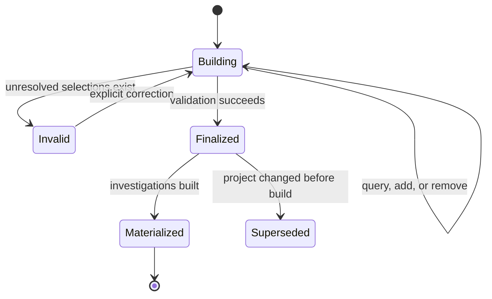

Invalid IDs are never auto-corrected. Suggestions are non-mutating. Batch additions preserve valid entries and reject each invalid entry independently. Finalization locks the exact ordered selection, Knowledge Base release, and project revision.

If relevant Project Memory changes after materialization, Xekute computes an applicability delta. It may propose new investigations or mark existing ones `needs_retest`, but it does not silently remove completed history.

### Detailed Evidence Memory architecture

Evidence Memory is the authoritative finding lifecycle. It should build on Xekute's existing finding validation, evidence records, `store_finding`, `verify_finding`, and report-generation workflows.

Evidence Memory contains **only confirmed vulnerabilities with severity from low through critical**. Suspected, candidate, rejected, inconclusive, and informational security observations remain in Investigation Memory or Project Memory. They may reference proof artifacts, but they do not receive an Evidence Memory finding record until the verification gate succeeds.

#### Finding lifecycle

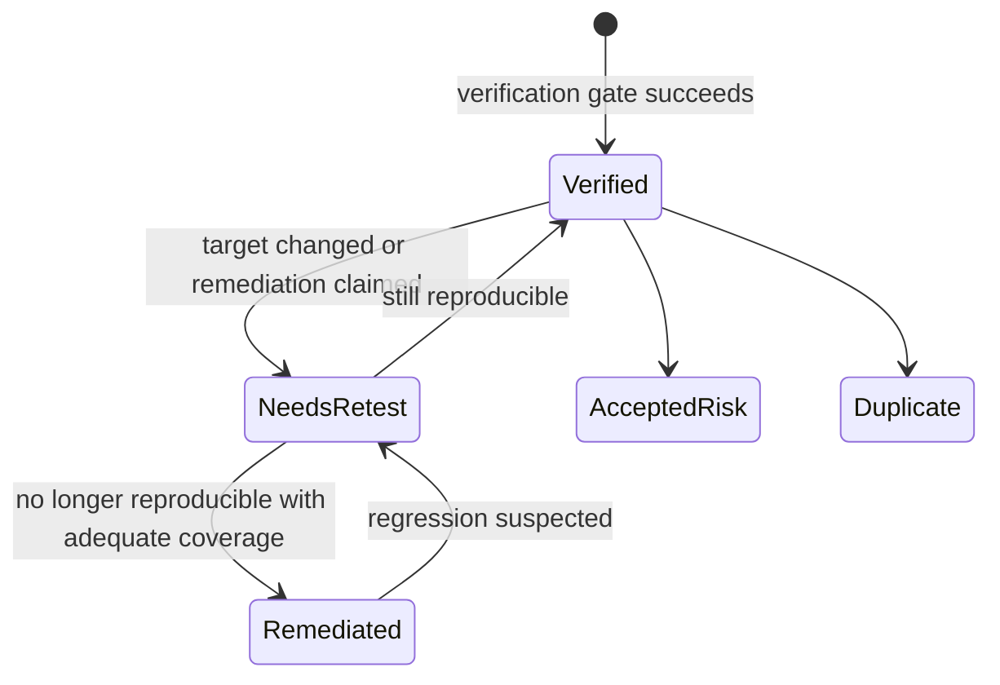

Candidate and verification work occurs in Investigation Memory. Evidence Memory begins at `Verified`. `Verified`, `NeedsRetest`, `Remediated`, `AcceptedRisk`, and `Duplicate` preserve the confirmed vulnerability's lifecycle; report views decide which lifecycle states are currently active.

#### Verification gate

Promotion to `verified` requires:

- at least one affected Project Memory entity;
- a defined vulnerability class or explicit custom class;
- a baseline and exploit/control comparison when the class requires it;
- immutable or content-addressed proof artifacts;
- an impact statement bounded to demonstrated behavior;
- a reproducible method and prerequisites;
- a verification verdict produced through the trusted lifecycle;
- no unresolved critical evidence gap;
- scope and authorization records showing the verification was permitted.
- a normalized severity of `low`, `medium`, `high`, or `critical`.

Severity is evaluated only after verification. An `informational` result is routed to a bounded Project Memory fact or Investigation Memory observation instead of Evidence Memory. Confidence describes proof strength and is not a replacement for verification state.

#### Evidence lineage

A finding links to:

- affected Project Memory entities;
- originating investigations and attempts;
- baseline, exploit, comparison, screenshot, or external-reference artifacts;
- verification verdicts and verifier identity;
- related or duplicate findings;
- remediation and retest history;
- report sections generated from it.

Evidence Memory stores proof structure and concise descriptions, not complete request or response bodies. Reports consume Evidence Memory and expand artifacts through controlled readers.

### Detailed Knowledge Base Memory architecture

Knowledge Base Memory should support more than one versioned collection:

1. **OWASP WSTG procedures** — canonical indexes, objectives, test sections, references, and remediation.
2. **Xekute assessment skills** — existing Markdown technique library, advanced variants, and MCP/tool mappings.
3. **Framework mappings** — CWE, OWASP Top 10, ASVS, CAPEC, and MITRE references where locally available.
4. **Operator extensions** — explicitly imported project-independent procedures, kept in a separate trusted namespace.

#### Knowledge release

A Knowledge Base release is immutable:

```json
{
  "release_id": "kb_wstg_2026_08_sha256_...",
  "collection": "OWASP-WSTG",
  "upstream_version": "pinned-release-or-commit",
  "ingested_at": "2026-08-26T00:00:00.000Z",
  "content_hash": "sha256:...",
  "schema_version": 1,
  "procedure_count": 120,
  "source_manifest": []
}
```

`latest` may be a user-interface alias, but investigations always resolve it to a concrete immutable release before selection begins.

#### Procedure structure

Each procedure contains bounded metadata separately from detailed sections:

- stable procedure ID and title;
- collection and release;
- category and phase;
- summary and test objectives;
- applicability signals and exclusions;
- required target entity types;
- prerequisites and required identities;
- available sections;
- safety and authorization considerations;
- related and advanced procedures;
- framework mappings;
- source references and content hash.

Detailed bodies remain section-addressable. The compact catalogue does not include full procedure prose.

#### WSTG and Xekute skill relationship

WSTG remains the baseline testing taxonomy. Existing Xekute skills may extend a WSTG procedure, provide advanced variants, map to tool adapters, or define specialized workflows. They do not overwrite upstream WSTG content. The relationship is represented explicitly, for example `IMPLEMENTS`, `EXTENDS`, `ADVANCED_VARIANT_OF`, `RELATED_TO`, or `REQUIRES`.

This preserves Xekute's current Markdown-first skill engine while adding reproducible WSTG coverage.


## SECTION C — RETRIEVAL ENGINE

This section defines how Xekute retrieves bounded, revision-aware information from memory, knowledge, artifacts, indexes, and graph projections without loading entire stores into an agent's context.

### Supporting services

#### Artifact Store

The Artifact Store contains raw or large material that should not be embedded in structured memory. Examples include:

- HTTP requests and responses;
- screenshots and browser captures;
- scanner and command output;
- network traces;
- downloaded files;
- generated proof material;
- imported source documents.

Artifacts receive stable identifiers, content hashes, project ownership, timestamps, source metadata, sensitivity labels, and retention rules. Memories refer to those identifiers and explain the role an artifact plays, such as observation source, test record, baseline, exploit proof, or verification proof.

The Artifact Store is supporting infrastructure rather than a sixth semantic memory domain.

#### Retrieval Engine

The Retrieval Engine is the controlled gateway between stored semantic memory and an agent's active context. Its job is not limited to selecting WSTG indexes. At the architecture level, it provides bounded retrieval across all semantic memory domains and Operational Context Memory. Sensitive Working Memory raw values are outside the generic Retrieval Engine.

It can return:

- a compact project summary;
- selected entities and graph neighborhoods;
- changes since a known memory revision;
- active investigations and coverage;
- findings affecting a target entity;
- artifact metadata and references;
- a compact Knowledge Base index;
- requested Knowledge Base sections.

Retrieval results identify their source memory, source revision or version, query scope, and truncation state. Selection may be initiated by an agent, but validation, filtering, access control, ordering, and state construction are deterministic.

The Retrieval Engine may return non-secret Sensitive Working Memory health and handle metadata already present in the session checkpoint. Raw values can be accessed only through the Sensitive Working Memory Manager during an authorized typed tool execution.

#### Knowledge Graph

The Knowledge Graph is a derived, traversable projection of canonical records. It connects entities such as projects, assets, hosts, services, applications, endpoints, parameters, roles, identities, technologies, investigations, artifacts, and findings.

The graph does not independently invent or own facts. Every node and edge points back to an authoritative record, claim, or cross-memory reference. Graph projections can be rebuilt when canonical memory changes.

The graph supports questions that are difficult to answer from isolated documents, for example:

- Which authenticated roles can reach endpoints that process payment data?
- Which investigations apply to endpoints using a particular technology?
- Which findings affect assets behind the same service?
- Which claims depend on an artifact that has been retracted?
- Which portions of the attack surface have no completed investigation coverage?

### Retrieval Engine architecture

The Retrieval Engine has two cooperating planes:

1. **Memory Retrieval Plane** — retrieves bounded slices from Project, Investigation, Evidence, Artifact, Operational Context, and Graph stores.
2. **Knowledge Selection Plane** — browses versioned methodology and manages the explicit procedure-selection buffer used to build Investigation Memory.

#### Retrieval request envelope

```json
{
  "request_id": "retrieval_01K...",
  "project_id": "proj_01K...",
  "session_id": "session_01K...",
  "objective": "Select authorization tests for profile endpoints",
  "domains": ["project", "investigation", "graph", "knowledge"],
  "operation": "search",
  "filters": {},
  "source_revisions": {},
  "budget": {
    "max_items": 30,
    "max_tokens": 3000,
    "max_artifact_chars": 0
  }
}
```

#### Retrieval result envelope

```json
{
  "ok": true,
  "request_id": "retrieval_01K...",
  "source_revisions": {
    "project": 42,
    "investigation": 19,
    "graph": 31,
    "knowledge_release": "kb_wstg_2026_08_sha256_..."
  },
  "items": [],
  "source_refs": [],
  "pagination": {
    "returned": 20,
    "omitted": 84,
    "next_cursor": "cursor_..."
  },
  "token_accounting": {
    "estimated": 1840,
    "budget": 3000
  },
  "freshness": "current",
  "warnings": []
}
```

#### Deterministic responsibilities

The Retrieval Engine deterministically performs:

- schema validation;
- project and authorization filtering;
- exact ID validation;
- canonical normalization;
- stable ordering and pagination;
- source revision reporting;
- record-state and freshness filtering;
- redaction and sensitivity enforcement;
- token and item limiting;
- selection-buffer mutation;
- finalized-selection materialization.

The parent agent remains responsible for deciding what information is relevant and which procedures should be selected. The engine does not claim that model-driven relevance judgment is deterministic.

#### Agent-facing tool strategy

Xekute should avoid creating a large tool surface for every memory operation. The preferred evolution is:

- extend `query_assessment` into the read-only gateway for project, investigation, evidence, artifact metadata, and unified graph queries;
- retain `query_knowledge` for non-mutating Knowledge Base catalogue and procedure reads;
- add one typed investigation-management tool for selection-buffer and investigation mutations;
- keep `store_finding` and `verify_finding` as explicit Evidence Memory lifecycle tools;
- keep artifact creation inside typed tool result projection rather than exposing a generic arbitrary artifact writer;
- keep transcript and checkpoint management application-owned, not agent-callable.
- keep Sensitive Working Memory outside `query_assessment`, `query_knowledge`, graph queries, and generic artifact expansion; request and browser tools consume opaque sensitive handles through a dedicated main-process service.

Exact tool contracts should be finalized only after domain contracts are stable. Compatibility aliases can preserve existing agent prompts during migration.

#### Knowledge selection operations

The Knowledge Selection Plane implements the draft operations with explicit state boundaries:

- `dump_index` — compact procedure catalogue, optionally by category or phase;
- `query_index` — non-mutating procedure metadata or selected sections;
- `add_index` — validate every ID, append valid procedures, reject invalid procedures independently;
- `remove_index` — remove exact selected IDs;
- `list_selected` — return deterministic ordered state;
- `validate_selection` — report invalid, unavailable, or incompatible records without silently changing valid selections;
- `clear_selection` — clear only the active building selection;
- `finalize_selection` — lock procedure IDs, Knowledge Base release, project revision, and selection hash;
- `build_investigation_memory` — idempotently materialize or patch investigations from a finalized selection.

`query_index` never adds a procedure. Suggestions never mutate selection. Finalized selections cannot be edited; changes create a successor selection session.

#### Retrieval leases

Detailed Knowledge Base content and large graph packets are leased to one session for the current objective. A lease records source IDs, release, token size, and expiration reason. It expires on compression, session close, objective change, or explicit release.

The checkpoint retains procedure references but not leased full text. On resume, details are retrieved again from the pinned release. This formalizes the knowledge-lease behavior already present in the context compiler.

### Unified Knowledge Graph architecture

Xekute currently has multiple useful graph concepts: the deterministic traffic/application Map, normalized intelligence entities and relationships, and the Markdown skill knowledge graph. The target architecture should federate these through one query layer while preserving their different authorities.

#### Graph layers

The unified graph contains four logical layers:

1. **Target layer** — Project Memory entities, claims, and target relationships.
2. **Investigation layer** — procedures, investigations, test cases, attempts, assignments, and coverage.
3. **Evidence layer** — findings, verification verdicts, artifacts, and affected entities.
4. **Methodology layer** — Knowledge Base procedures, categories, extensions, and framework mappings.

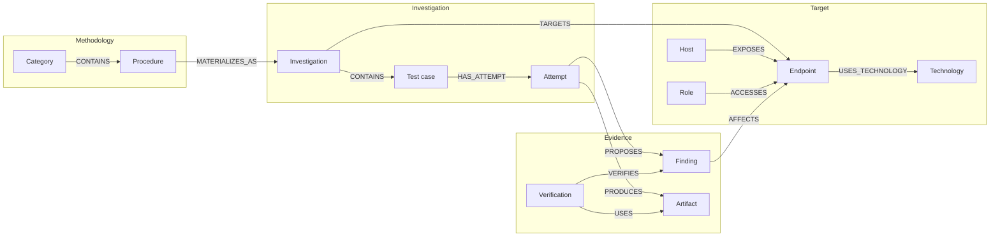

#### Canonical graph rules

- Every graph node has a canonical record reference and source memory.
- Every graph edge has a declared type, source record, state, and confidence where applicable.
- A graph builder may omit detail for size, but cannot alter source semantics.
- Deleted, retracted, or superseded source records produce tombstones or inactive graph elements until the next compaction snapshot.
- Cross-memory edges are generated from explicit references, never label matching alone.
- Raw sensitive values, encrypted payload references, and session-secret handles never become graph nodes, labels, properties, or edges. The graph may represent non-secret authentication mechanisms and identity relationships from Project Memory.
- Fuzzy correlation appears as a proposed edge and is excluded from authoritative traversal unless accepted.
- Graph snapshots record all source revisions and builder versions.
- The graph database or snapshot may be deleted and rebuilt from canonical memories and artifact indexes.

#### Relationship to the existing application Map

The existing traffic graph remains the deterministic behavioral projection of captured HTTP evidence. It supplies candidate hosts, endpoints, workflows, redirects, identity differentials, response clusters, and traffic provenance.

During ingestion:

1. the Map builder continues producing traffic graph snapshots;
2. the Project Memory normalizer resolves Map nodes to canonical target entities;
3. accepted target entities and relationships enter Project Memory with Map evidence references;
4. the unified graph links canonical entities back to Map nodes and variants;
5. the UI may continue rendering the specialized Map while using unified graph queries for investigation and finding overlays.

The traffic graph is therefore a high-value source and specialized view, not a competing project truth store.

#### Graph query operations

The existing `query_assessment` graph operations provide a useful compatibility surface. The target graph query service supports:

- overview and type counts;
- exact node retrieval;
- filtered search;
- bounded neighbors by edge type and confidence;
- bounded paths with cycle prevention;
- workflow and state-model views;
- identity and role differentials;
- endpoint variants and response clusters;
- anomalies and unresolved correlations;
- investigation coverage overlays;
- findings affecting a node or path;
- evidence and provenance expansion;
- changes since a graph projection revision.

All traversal operations enforce maximum hops, node counts, edge counts, token projections, and stable continuation cursors.

### Retrieval and context assembly

An agent's active context is assembled for the current objective. It is not a complete dump of all stored memory.

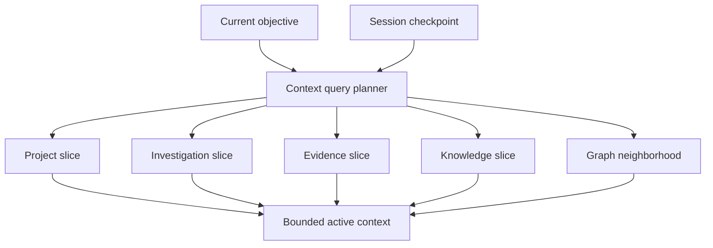

Context assembly prioritizes direct relevance, authoritative status, recency, provenance, and token budget. Every returned slice exposes enough metadata for the agent to understand what was included, what revision it represents, and whether additional detail is available.

### IPC and user-interface integration

#### IPC boundary

Memory IPC handlers live in the main process and expose bounded operations such as:

- memory health and revision status;
- current project overview;
- paginated records and provenance;
- graph queries;
- investigation selection and state mutations;
- finding review and verification state;
- session checkpoint inspection;
- Sensitive Working Memory health, handle counts, identity bindings, and expiry status without raw values;
- index rebuild, migration preview, and recovery status.

Every IPC request validates project binding, input length, enum values, pagination, and operation authorization. The renderer never supplies an arbitrary storage path.

No generic renderer IPC returns raw Sensitive Working Memory payloads. Cookie, token, and certificate materialization occurs only inside trusted request, browser, replay, identity, or certificate adapters after authority checks.

#### Context Usage popup

Memory internals remain hidden from ordinary users. Xekute's existing Context Usage popup is the single user-facing memory surface and displays:

- total used and available tokens;
- token allocation for System prompt;
- token allocation for Tool definitions;
- token allocation for Project Memory, shown as **Project**;
- token allocation for Investigation Memory, shown as **Investigation**;
- token allocation for Evidence Memory, shown as **Evidence**;
- token allocation for Agent Session Memory, shown as **Conversation** and combining Active Workflow with the Recent Working Set;
- token allocation for Rules;
- token allocation for Skills.

The popup does not expose canonical records, graph traversal, provenance bodies, investigation details, finding details, sensitive handles, migration controls, or raw memory queries. Those capabilities remain available only through trusted internal services, bounded agent retrieval, and privileged diagnostics or recovery workflows. Sensitive Working Memory values are never represented in token allocation or rendered in the popup.

#### Transparency language

The UI should distinguish:

- **Observed** from **Verified**;
- **Inferred** from **Operator asserted**;
- **Not reproduced** from **Not vulnerable**;
- **Finding candidate** from **Verified finding**;
- **Current** from **Stale** or **Superseded**;
- **Canonical record** from **Derived projection**.

These distinctions must appear consistently in chat cards, Map overlays, finding screens, reports, and memory inspection.


## SECTION D — CONTEXT SUMMARIZATION

This section defines Agent Session Memory's two subcategories and session-only summarization. The Context Summarizer compresses conversational and operational state into Operational Context Memory checkpoints. Sensitive Working Memory stores encrypted live authentication state and is never summarized.

### Context Summarizer responsibilities

The Context Summarizer operates only on the Operational Context Memory subcategory of Agent Session Memory. Its purpose is to let one agent continue a long conversation without repeatedly sending the complete transcript to the model.

Its responsibilities are:

1. select a completed transcript boundary;
2. collect validated context capsules and attributed user requirements for that session;
3. preserve the current objective, constraints, decisions, blockers, unresolved questions, active processes, and next actions;
4. replace duplicated semantic detail with references to records already committed by the Memory Updater;
5. create an integrity-checked Operational Context Memory checkpoint;
6. retain a bounded recent transcript tail after the checkpoint boundary;
7. merge messages appended while summarization was running;
8. report source revisions and staleness so the next context can refresh shared memory.

The Context Summarizer has no write authority over Sensitive Working Memory, Project Memory, Investigation Memory, Evidence Memory, Knowledge Base Memory, or the Artifact Store. It cannot create, reveal, rotate, revoke, or delete a cookie, token, certificate, or private-key reference. It cannot promote a fact, verify a finding, close an investigation, alter coverage, or create graph truth. It writes only the Operational Context Memory checkpoint and summarization metadata.

Context summarization may be triggered by context pressure, a session handoff, session close, model change, an explicit checkpoint request, or a configured major-episode boundary. Completion of an ordinary agent chat block does **not** by itself trigger summarization. Regardless of trigger, its destination remains the Operational Context Memory subcategory only.

### Context summarization architecture

Context summarization applies exclusively to conversational and operational state in Operational Context Memory. It never summarizes, rewrites, or compacts Sensitive Working Memory or the authoritative semantic contents of Project Memory, Investigation Memory, Evidence Memory, or Knowledge Base Memory.

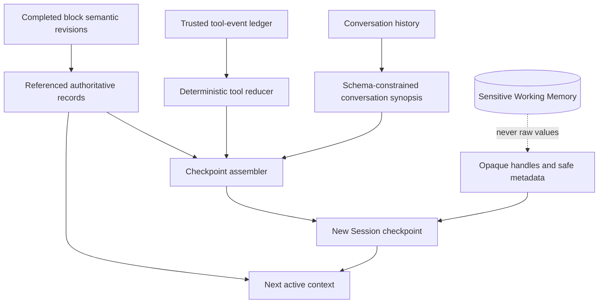

The context-summarization process follows four principles:

1. **Commit before compressing.** Durable facts, investigation updates, findings, and artifacts are written to their authoritative stores before supporting conversation detail is discarded.
2. **Reference instead of duplicate.** The session checkpoint stores stable identifiers and revisions rather than copying large authoritative records.
3. **Preserve operational continuity.** Current goals, constraints, decisions, blockers, unresolved questions, and next actions remain directly available to the agent.
4. **Detect staleness.** A resumed session compares pinned revisions with current revisions and retrieves changes before relying on cached summaries.

The apparent “two summaries” are intentionally different mechanisms:

- the **conversation synopsis** may use a model, but it must produce a validated schema containing objectives, user constraints, decisions, blockers, unresolved questions, and next actions;
- the **tool-event ledger** is produced deterministically from trusted lifecycle events. It clusters repeated traffic and tool activity, retains security-relevant variants and failures, and emits stable artifact and memory references. It is reduction, not free-form model summarization.

The next active context is assembled from the checkpoint's conversation synopsis, deterministic tool-event ledger, recent exact transcript tail, and newly retrieved bounded memory slices. The two products are combined only during checkpoint and context assembly; they do not share write authority and neither becomes semantic truth.

Compression must never promote an unverified conversational statement into Project Memory or Evidence Memory. A summary is a navigational checkpoint, not a new source of truth.

### Detailed Agent Session Memory architecture

Agent Session Memory must distinguish four things that are currently easy to conflate:

1. the exact durable transcript shown in chat history;
2. the structured operational checkpoint used to resume work;
3. the encrypted Sensitive Working Memory used by request and browser tools;
4. the bounded active context sent to the model.

#### Exact transcript

The existing session store remains the owner of exact submitted prompts, assistant output, tool calls, tool results, questions, partial output, stop state, and completion metadata. It is appended incrementally during the block. Compression does not edit, delete, or rewrite this transcript.

#### Deterministic tool-event reduction

Tool results are not all retained verbatim in active model context. The reducer consumes sanitized lifecycle events and artifact metadata, never raw Sensitive Working Memory payloads, and emits a compact ledger of:

- unique tool actions and their terminal outcomes;
- representative traffic clusters and security-relevant variants;
- failures, blockers, incomplete processes, and retries;
- affected target, investigation, evidence, and artifact references;
- omitted-event counts and the deterministic fingerprints used for clustering.

Raw traffic and full tool output remain in the Artifact Store or exact transcript according to their source policy. A traffic fingerprint must include at least method, normalized route, identity or role, authentication state, response status, response-schema hash, and security-relevant variation flags. Repetition updates counts and `last_observed_at`; it does not create another active-context entry. Any difference that can affect a security conclusion remains a distinct variant.

#### Structured checkpoint

A checkpoint is created from trusted context capsules, runtime events, attributed user requirements, and explicit references to shared memories. It contains:

```json
{
  "schema_version": 2,
  "session_id": "session_01K...",
  "agent_id": "agent_parent",
  "checkpoint_id": "checkpoint_01K...",
  "covers": {
    "first_block_id": "block_12",
    "last_block_id": "block_28",
    "last_message_id": "message_01K..."
  },
  "objective": {
    "current": "Investigate refresh-token invalidation after logout.",
    "completion_criteria": [],
    "operator_constraints": []
  },
  "working_state": {
    "mode": "agent",
    "phase": "authentication-testing",
    "active_investigation_refs": ["inv_01K..."],
    "active_process_refs": [],
    "blocked_patterns": [],
    "unresolved_questions": [],
    "next_actions": []
  },
  "memory_revisions": {
    "project": 42,
    "investigation": 19,
    "evidence": 7,
    "graph": 31,
    "knowledge_release": "kb_wstg_2026_08_sha256_..."
  },
  "retained_record_refs": [],
  "sensitive_working_memory": {
    "store_ref": "sensitive_session_01K...",
    "active_handle_refs": ["secret_cookie_01K..."],
    "raw_values_included": false
  },
  "known_gaps": [],
  "recent_tail_start": "message_01K...",
  "created_at": "2026-08-26T12:30:00.000Z",
  "integrity_hash": "sha256:..."
}
```

The checkpoint does not copy complete Project, Investigation, or Evidence records. It retains stable references and only enough cached wording to preserve the active objective and decisions. It may retain opaque Sensitive Working Memory handles and non-secret lifecycle metadata, but never raw values, encrypted payloads, private keys, or directly reusable authorization headers.

#### Sensitive Working Memory

Sensitive Working Memory is the protected operational subcategory of Agent Session Memory. It holds live authentication and transport state that an authorized agent needs to make, replay, compare, or modify requests without repeatedly asking the operator to authenticate.

It is intentionally different from summarized context. Its values are machine-usable secrets, not prose. They are selected and materialized by trusted tool adapters at execution time.

##### Stored material

Sensitive Working Memory may contain:

- raw cookie values and complete browser-grade cookie attributes;
- a derived `Cookie` request-header value for a specific origin and request;
- bearer, access, refresh, anti-CSRF, nonce, state, and one-time session tokens;
- authorization headers or request-signing material generated for the active identity;
- authentication-relevant `localStorage`, `sessionStorage`, or IndexedDB values explicitly selected by the browser adapter;
- client-certificate chains used for mutual TLS;
- references to private keys, passwords, or reusable credentials held by the Identity Vault;
- temporary certificate passphrases when an authorized import requires them;
- origin, identity, role, browser-context, proxy-context, and request-session bindings;
- rotation, expiry, revocation, and last-use state.

It must not become a general dumping ground for response bodies, arbitrary browser storage, scanner output, or evidence. Those belong in the Artifact Store. It must not become a long-term credential manager. Reusable credentials and private keys belong in the Identity Vault.

##### Sensitive entry model

```json
{
  "schema_version": 1,
  "memory_type": "agent_session",
  "memory_subtype": "sensitive_working_memory",
  "sensitive_memory_id": "sensitive_session_01K...",
  "project_id": "proj_01K...",
  "session_id": "session_01K...",
  "agent_id": "agent_parent",
  "state": "active",
  "entries": [
    {
      "handle": "secret_cookie_01K...",
      "kind": "cookie",
      "name": "session",
      "secret_payload_ref": "safe_storage_blob_01K...",
      "binding": {
        "identity_ref": "identity_test_user",
        "browser_context_ref": "browser_context_01K...",
        "origin": "https://example.com"
      },
      "cookie": {
        "domain": "example.com",
        "path": "/",
        "host_only": true,
        "secure": true,
        "http_only": true,
        "same_site": "Lax",
        "partition_key": null
      },
      "source": {
        "type": "set_cookie",
        "artifact_ref": "artifact_01K...",
        "captured_at": "2026-08-26T12:00:00.000Z"
      },
      "lifecycle": {
        "state": "active",
        "created_at": "2026-08-26T12:00:00.000Z",
        "updated_at": "2026-08-26T12:00:00.000Z",
        "expires_at": "2026-08-26T13:00:00.000Z",
        "last_used_at": null,
        "supersedes": null
      },
      "access_policy": {
        "model_visible": false,
        "tool_materialization_only": true,
        "delegatable": false
      }
    }
  ],
  "updated_at": "2026-08-26T12:00:00.000Z"
}
```

The record stores metadata and an opaque encrypted-payload reference. The raw value is inside the protected sensitive-session container. It never appears in the checkpoint JSON.

##### Cookie-jar behavior

The Sensitive Working Memory service provides a browser-grade cookie jar rather than a flat string map.

A cookie is identified by its name, normalized domain, path, and partition context. The service retains host-only, Secure, HttpOnly, SameSite, expiry, creation, priority, and other supported attributes supplied by the active browser engine. It applies cookie replacement and deletion rules when a new `Set-Cookie` response is accepted.

For an outgoing request, the request adapter asks the service to materialize cookies for the exact URL, top-level site or partition context, HTTP method, browser context, and identity. The service filters expired, revoked, domain-mismatched, path-mismatched, Secure-only, and otherwise inapplicable entries before constructing the header.

The agent works with handles and safe metadata. It can ask a typed tool to:

- replay a request with the active cookie jar;
- omit one cookie;
- replace a cookie with an explicitly supplied test value;
- clone the current cookie into a short-lived test variant;
- compare anonymous and authenticated requests;
- decode a supported token into non-secret structural metadata;
- invalidate or clear an identity's session state.

These operations let the agent test session and authorization behavior without copying the live cookie value into its prompt.

##### Certificate and key behavior

Certificate handling distinguishes public evidence from secret operational material:

- an observed server certificate and its public chain belong in the Artifact Store, with durable target facts in Project Memory;
- a client certificate used for mutual TLS may be held in Sensitive Working Memory for the current session;
- a reusable client private key remains in the Identity Vault and is referenced by an opaque key handle;
- an imported short-lived key may be encrypted in Sensitive Working Memory only when the Identity Vault cannot own it and policy explicitly allows it;
- Xekute's interception-proxy CA and private key remain application infrastructure, not Agent Session Memory;
- certificate passphrases are short-lived sensitive entries and are discarded immediately after successful import or use where possible.

Request adapters receive a combined certificate capability that references the client chain and vault key. The agent sees certificate subject, issuer, fingerprint, expiry, intended use, and handle metadata, but not the private key.

##### Sensitive Working Memory Manager

Sensitive Working Memory is maintained by a dedicated session-runtime manager. This is not a third semantic memory processor:

- the **Memory Updater** continues to update Project, Investigation, and Evidence Memory at block finalization;
- the **Context Summarizer** continues to update only Operational Context Memory;
- the **Sensitive Working Memory Manager** performs mechanical secret capture, matching, rotation, expiry, revocation, and tool materialization inside Agent Session Memory.

The manager accepts input only from trusted sources:

- browser-context cookie and storage APIs;
- controlled request and replay adapters;
- identity-vault materialization;
- explicitly authorized operator import;
- validated authentication workflow outputs.

It never extracts secrets by interpreting assistant prose. It may register artifact provenance for where a cookie or token was observed, but it does not copy raw artifact content indiscriminately.

##### Sensitive lifecycle

Sensitive entries use the following lifecycle states:

- `active` — eligible for matching and authorized tool materialization;
- `rotated` — replaced by a newer value but retained briefly for request lineage;
- `expired` — expiry time passed and materialization is denied;
- `revoked` — logout, explicit invalidation, identity change, or verifier action made the value unusable;
- `quarantined` — integrity, origin, ownership, or import checks failed;
- `deleted` — encrypted payload removed and handle permanently invalidated.

Expiry and revocation are enforced at materialization time even when cleanup has not yet run. A logout or explicit session reset revokes all bound cookie, token, and derived authorization handles unless the tool result identifies a narrower rotation.

##### Request and response flow

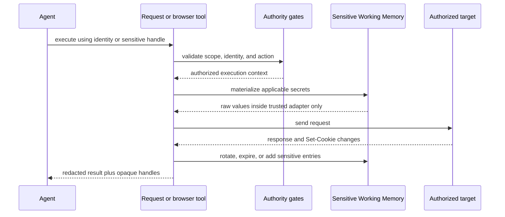

Raw values exist only inside the trusted main-process adapter and outbound request construction path. Model-facing results contain handles, cookie names, scopes, expiry, fingerprints, and redacted previews where policy allows.

##### Disclosure policy

Raw secrets are not included in ordinary model prompts, tool-result messages, exact chat transcripts, Agent Session checkpoints, Context Summarizer input, Project Memory, Investigation Memory, Evidence Memory, Knowledge Base content, SQLite indexes, Knowledge Graph snapshots, UI notifications, or audit logs.

Most workflows do not require model-visible values because typed tools can replay, omit, replace, decode, compare, and invalidate through handles. Any future raw-secret reveal to a model must be a separate high-risk capability with explicit operator approval, provider/data-handling checks, one-turn lifetime, non-persistence, and a disclosure audit event. It is not enabled merely by creating Sensitive Working Memory.

##### Persistence and recovery

Sensitive Working Memory persistence requires secure encryption. The store:

- encrypts the whole container or each payload with Electron `safeStorage` or an equally protected platform provider;
- binds encrypted records to project, session, and agent identifiers;
- uses atomic replacement and backup recovery without retaining plaintext temporary files;
- never writes raw values to JSONL event logs;
- stores only redacted lifecycle events in ordinary audit logs;
- validates container integrity before materialization;
- refuses persistence when protected encryption is unavailable;
- deletes expired payloads according to the shortest applicable session, token, or project-retention limit.

A resumable session may retain active encrypted entries across restart when project policy permits. A closed, deleted, or archived session revokes its handles and deletes session-only payloads unless the operator explicitly promotes reusable identity material into the Identity Vault. Promotion is never automatic.

##### Subagent and handoff isolation

Sensitive Working Memory is private to its owning agent session. A specialist agent does not inherit the parent's cookie jar, token set, or certificate capability by default.

When authenticated delegation is required, the parent grants a bounded use lease identifying allowed handles, target origins, tool operations, expiry, and non-disclosure policy. The specialist receives the lease handle, not the raw values. Handoff to another session rebinds only explicitly transferable handles and records the transfer; all other handles remain inaccessible.

##### Relationship to other stores

- **Identity Vault:** owns reusable credentials, passwords, and private keys. Sensitive Working Memory holds temporary materializations and references.
- **Artifact Store:** owns captured request/response evidence. Sensitive Working Memory owns the current usable secret state derived from that evidence.
- **Project Memory:** may record that cookie-based authentication or mutual TLS exists, but never stores live values.
- **Investigation Memory:** records what session behavior was tested and references handles or artifacts, never reusable raw secrets.
- **Evidence Memory:** stores proof references and redacted reproduction requirements, not active authentication material.
- **Operational Context Memory:** stores only opaque handles and safe metadata needed to continue the session.

#### Context capsules

Xekute's existing context-capsule boundary should remain central:

- capsules are built from validated tool lifecycle results, not interpreted assistant prose;
- every factual record has source references;
- capsule integrity is checked before reduction;
- unsupported or malformed outputs become residues rather than facts;
- explicit user requirements remain attributed as user assertions;
- deterministic reduction deduplicates repeated records and preserves required records;
- sensitive result fields are removed before capsule creation and replaced with opaque handles plus safe metadata.

The capsule record kinds should be aligned with target ownership:

- `project_observation`;
- `investigation_attempt`;
- `investigation_decision`;
- `finding_candidate`;
- `finding_verification`;
- `workspace_mutation`;
- `operator_requirement`;
- `retrieval_reference`;
- `process_state`;
- `residue`.

Each projector may propose a mutation only to its corresponding memory owner.

#### Context-summarization stages

Xekute already exposes context pressure bands at approximately 55%, 70%, 82%, and 90% of the working prompt budget. The expanded architecture assigns explicit behavior to those bands:

| Pressure band | Required behavior |
|---|---|
| Below `prepare` | Normal retrieval and recent working set |
| `prepare` | Seal completed episodes, precompute capsules, expire unused knowledge detail, and identify large tool results |
| `compress` | Commit durable promotions, create a new structured checkpoint, replace old active conversation with checkpoint plus bounded tail |
| `urgent` | Reduce low-priority retrieval packets, shorten the recent tail, collapse repetitive successful operations, preserve failures and unresolved work |
| `emergency` | Use deterministic canonical rendering and minimum viable tail; do not wait for optional model synthesis |

Threshold values remain controlled by `context-budget.js` and may be tuned by tests. The architecture requires the semantics above even if percentages change.

#### Context-summarization transaction

Compression follows this order:

1. freeze a source boundary using message and block IDs;
2. collect valid redacted capsules and runtime events within that boundary without reading raw Sensitive Working Memory payloads;
3. reduce and validate all required records;
4. resolve references against the latest completed block-finalization watermark;
5. record any durably queued semantic finalization as an explicit known gap rather than copying it as truth;
6. create the session checkpoint with resulting record references and revisions;
7. select a recent tail that begins after the checkpoint boundary;
8. assemble and token-check the replacement context;
9. atomically activate the checkpoint for the next model continuation;
10. merge messages appended during compression by message ID.

If model-assisted synthesis fails, deterministic canonical Markdown remains the fallback. A synthesis plan may group or phrase validated records, but cannot omit required records, alter claim states, invent IDs, or add unsupported facts.

#### Active context budget

The Context Assembly service divides the prompt budget into elastic sections:

- system prompt and tool definitions;
- operator authority and project status;
- Session Memory checkpoint;
- opaque Sensitive Working Memory handles and non-secret lifecycle status required for active tools;
- active workflow and investigations;
- retrieved Project Memory and graph slice;
- Evidence Memory references relevant to the task;
- leased Knowledge Base content;
- recent conversation and working set;
- response and reasoning reserve.

Budgets are token-based, not character-only. Each section reports requested, included, and omitted token counts. No section except the system/authority minimum has a permanent fixed percentage; allocation follows the current objective and mode.

Sensitive values are not token-budget participants because they are not part of ordinary model context. Handle metadata is budgeted as Operational Context Memory.

#### Resume and staleness handling

On resume, Xekute compares checkpoint revisions with current shared revisions. It retrieves deltas before using cached shared facts. If a referenced entity, investigation, or finding was superseded, the context packet contains the replacement reference. Missing records become explicit known gaps.

The resume path also validates Sensitive Working Memory handle health without materializing raw values. Expired, revoked, deleted, undecryptable, or process-only handles are marked unavailable, and the agent receives a re-authentication or identity-selection requirement instead of stale credentials.


## SECTION E — INTELLIGENCE GATHERING & AUTOMATIC MEMORY UPDATES

This section defines block-finalized semantic updating, immediate intelligence capture, artifact registration, semantic classification, automatic routing, cross-memory commits, multi-agent coordination, recovery, maintenance, and migration behavior.

### Memory Updater architecture

The Memory Updater is a deterministic semantic finalization service. Trusted Xekute events are captured throughout an agent chat block, but the updater normalizes and materializes shared semantic memory once after that block completes. It is invoked for every completed block and records a no-op result when nothing materially new was learned. It does not wait for context pressure, invoke the Context Summarizer, or require an LLM in its normal path.

The updater consumes a sealed **block finalization envelope** containing the block ID and terminal state, ordered trusted event IDs, artifact references, source hashes, the starting memory revisions, actor and session identity, and the expected final transcript boundary. It never scans assistant prose to infer facts.

Its responsibilities are:

1. receive the completed block envelope containing trusted tool lifecycle results, structured specialist returns, attributed operator-authored changes, artifact metadata, and verification events;
2. deterministically reduce, normalize, cluster, and deduplicate the block before producing bounded candidate records;
3. determine whether each candidate is genuinely new, a repeat observation, stronger corroboration, a contradiction, or a replacement for existing knowledge;
4. classify the information by authoritative owner;
5. normalize identities and resolve exact duplicates;
6. validate provenance, lifecycle transitions, scope, sensitivity, and references;
7. commit idempotent revisioned updates in the required dependency order;
8. persist or resume cross-memory outbox work;
9. return committed record IDs, resulting revisions, conflicts, rejected candidates, and a project finalization watermark.

The routing rule is:

| Detected information | Destination |
|---|---|
| New target asset, endpoint, technology, role, behavior, attribute, or relationship | Project Memory |
| New hypothesis, applicable test, attempt, negative result, blocker, coverage change, assignment, remaining work, finding candidate, failed verification, or informational observation | Investigation Memory |
| Newly verified low, medium, high, or critical vulnerability; or lifecycle update to an existing confirmed vulnerability | Evidence Memory |
| Raw request, response, screenshot, file, scan output, or large tool result | Artifact Store, followed by a reference in the owning memory |
| Live cookie, token, authorization header, client-certificate capability, or authentication-related browser state | Not handled by the semantic Memory Updater; routed to the Sensitive Working Memory Manager |
| Current conversational objective, wording, user dialogue, or short-term reasoning state | Not handled by the Memory Updater; eligible only for Operational Context Memory summarization |

The Memory Updater never creates an Evidence Memory candidate. Candidates and verification attempts remain in Investigation Memory. It creates an Evidence Memory record only when the defined verification gate has been satisfied by trusted verification records and severity is low through critical. Detection alone never upgrades a suspicion into a confirmed vulnerability.

The Memory Updater never treats assistant prose as a fact source. Assistant text may request or describe a proposed update, but the updater accepts durable semantic changes only from trusted lifecycle results, attributed operator input, validated imports, or deterministic derivations from canonical records.

The updater is logically one service but uses domain-specific detectors and projectors. Project, Investigation, and Evidence Memory retain separate schemas and lifecycle rules; the updater does not combine them into one store. The same normalized candidate may cause references in multiple domains, but each domain accepts only the portion it owns.

#### Material-delta and deduplication rules

Running the updater after every block does not mean writing every memory after every block. A revision advances only when accepted state changes.

- An exact duplicate produces no new entity, claim, attempt, finding, or revision.
- A repeat observation may update provenance and `last_confirmed_at` when freshness changes materially; repeated occurrences inside the same block are coalesced.
- A stronger source may corroborate or advance a claim according to its predicate policy.
- A conflicting observation creates or updates a dispute; it never silently overwrites the active claim.
- An alias resolves to an existing canonical entity only under deterministic identity rules. Ambiguous matches remain unresolved.
- An equivalent verified vulnerability updates confirmation, proof, or affected-target lineage rather than creating a duplicate finding.
- A tool or traffic cluster retains counts plus representative and security-relevant variants while raw records remain in the Artifact Store.

Project Memory finalization should normally be computational and consume zero model tokens. A future model-assisted classifier may propose an unresolved mapping only behind an explicit policy, but it cannot directly commit semantic truth.

### Processing order and separation invariants

#### Required ordering

Within one completed agent chat block, ordering is strict:

```text
while block is running
  -> exact transcript is appended
  -> raw artifacts and trusted execution events are durably registered
  -> Sensitive Working Memory captures or rotates live secret state immediately

when block reaches a terminal boundary
  -> seal the block event range and enqueue one finalization operation
  -> normalize and deduplicate the block
  -> commit new Project Memory facts and relationships
  -> if Project Memory materially changed, retrieve pinned Knowledge Base applicability
  -> update Investigation Memory from applicability and execution deltas
  -> promote only verification-gated low-critical vulnerabilities to Evidence Memory
  -> publish the finalization watermark and rebuild derived views asynchronously

only when summarization is independently required
  -> Context Summarizer references committed records and pending-operation gaps
  -> Operational Context Memory checkpoint is activated
```

If a semantic update cannot complete immediately, the Memory Updater first persists an idempotent recovery operation. The Context Summarizer records that pending operation as a known gap; it does not copy the uncommitted claim into the session checkpoint as established truth.

#### Separation invariants

1. The Memory Updater updates shared semantic memories but never summarizes conversation.
2. The Context Summarizer summarizes session context but never updates shared semantic memories.
3. Trusted capture is event-driven, while semantic materialization is block-finalized and independent of context-window pressure.
4. Context summarization is session-scoped and cannot create canonical facts.
5. Semantic updates are committed or durably queued before their references enter a checkpoint.
6. A failed summarization does not roll back already committed semantic updates.
7. A failed semantic update appears as a pending operation or known gap, never as summarized truth.
8. The Sensitive Working Memory Manager may update live session secrets without creating a semantic fact.
9. Neither the Memory Updater nor the Context Summarizer may read or write raw Sensitive Working Memory payloads.
10. Completion of a block invokes the updater exactly once logically; retries use the same idempotency key.
11. Completion of a block does not automatically invoke the Context Summarizer.
12. The next block must not unknowingly assemble context from a partially finalized predecessor.

#### Per-project finalization queue and watermark

Each project has a single ordered semantic-finalization queue. Blocks from different sessions may execute concurrently, but their semantic commits are serialized or optimistic-concurrency retried against current domain revisions. Every accepted terminal block receives a monotonically ordered finalization position and durable operation ID.

The project publishes a watermark containing the latest sealed block, latest fully applied block, per-domain revisions, pending outbox count, and failure state. Before assembling a new block, Context Assembly must either:

1. wait for the immediately preceding relevant finalization within a short bounded deadline;
2. apply an already available deterministic pending delta to the context packet; or
3. expose an explicit `memory_finalization_pending` gap and avoid claiming stale state as current.

The user-facing response does not need to wait for optional graph, SQLite, or Knowledge Base read-model rebuilding. The trusted event journal and durable finalization job must be committed before the block is reported as safely finalized.

### End-to-end information flow

#### 1. Observation and ingestion

An agent or tool observes the target. During the block, raw output is written to the Artifact Store, trusted normalized lifecycle events are appended to the execution journal, and exact transcript records are persisted. Live authentication material detected through trusted browser or request adapters is immediately registered or rotated in Sensitive Working Memory so a later tool call in the same block can use it. No shared semantic memory is required to advance at this point.

#### 2. Block normalization and Project Memory update

At the terminal block boundary, the Memory Updater seals the event range and deterministically removes noise, clusters repeated traffic and tool activity, resolves exact identities, and classifies candidates. New evidence-backed knowledge about the target is committed to Project Memory. Repeated knowledge is deduplicated, stronger corroboration refreshes provenance, and contradictions become disputes. If there is no material Project Memory delta, its revision does not change.

#### 3. Investigation applicability update

Only when Project Memory's `coverage_inputs` materially change does the Retrieval Engine query the project's pinned Knowledge Base release. It computes an applicability delta and updates the Investigation checklist: new applicable tests, changed target bindings, priority changes, `needs_retest`, or bounded `not_applicable` decisions. It does not query the entire Knowledge Base after every block and does not erase completed investigation history.

#### 4. Investigation execution update

Independently of Project Memory changes, the same finalized block updates Investigation Memory with trusted attempts, outcomes, negative results, blockers, coverage dimensions, candidate vulnerabilities, and remaining work. This execution path is necessary because a valid test can change coverage without teaching Xekute a new fact about the application.

#### 5. Evidence promotion

After Investigation Memory has accepted the block's verification outcomes, the coordinator promotes only confirmed low, medium, high, or critical vulnerabilities that satisfy the Evidence Memory gate. Evidence Memory records the technique, affected target, proof, demonstrated impact, remediation, verification history, and retest lifecycle. Failed or inconclusive verification and informational observations remain outside Evidence Memory.

#### 6. Derived projection and publication

The updater completes required cross-memory outbox transitions, publishes the finalization watermark, and schedules Knowledge Graph and SQLite projection work. Derived projections may finish asynchronously because they can be rebuilt from canonical records.

#### 7. Session continuity and compression

The exact transcript remains intact. Only when context pressure or another continuity trigger requires it, the Context Summarizer creates a new Operational Context Memory checkpoint from a schema-constrained conversation synopsis plus the deterministic tool-event ledger, authoritative references, a bounded recent transcript tail, and opaque sensitive handles. It never reads or copies raw Sensitive Working Memory values.

#### 8. Resume, handoff, and collaboration

The same agent or a new agent loads the latest session checkpoint, checks the referenced memory revisions, retrieves any changed shared state, and continues. Multiple agents coordinate through revisioned shared memories rather than through copied conversation summaries.

### Common identity model

Stable cross-memory references require one identity system.

#### Identifier rules

- IDs are opaque, immutable, and prefixed by type.
- IDs never encode a mutable hostname, path, title, severity, or workspace location.
- Moving or renaming a project does not change its `project_id`.
- Renaming an entity does not change its `entity_id`.
- Deduplication keys are separate from public identifiers.
- Artifact identifiers are either immutable record IDs or content-addressed IDs.
- Legacy IDs are retained as aliases during migration.
- An ID from one project cannot resolve inside another project.

Recommended prefixes include:

```text
proj_       project
session_    agent session
block_      durable turn block
entity_     project entity
claim_      project claim
rel_        typed relationship
inv_        investigation
attempt_    investigation attempt
finding_    verified or lifecycle-managed finding
artifact_   raw artifact or artifact manifest record
kb_         knowledge-base release
procedure_  knowledge procedure
sel_        knowledge-selection session
op_         cross-memory operation
event_      immutable memory event
```

Stable hashes may be used for deduplication and integrity, but a hash of the workspace path must not be the long-term project identity.

#### Canonical keys and alias resolution

Entities may have canonical matching keys used internally, for example:

- host: normalized hostname or IP plus environment;
- service: host entity, transport, and port;
- endpoint: application or host, HTTP method, and normalized route template;
- parameter: endpoint, location, and normalized name;
- technology: normalized product identity plus optional version range;
- identity: protected identity-vault reference, not a username or credential value;
- role: application plus normalized role name;
- artifact: project plus content hash or immutable source position.

Exact canonical-key matches may merge deterministically. Fuzzy matches produce suggestions only. Ambiguous records remain separate until an explicit merge mutation is approved. Every merge retains aliases and a redirect from retired IDs.

### Common record envelope

All canonical records share a bounded envelope so retrieval, auditing, migration, and graph projection do not need a custom interpretation for every memory type.

```json
{
  "schema_version": 1,
  "memory_type": "project",
  "record_type": "claim",
  "record_id": "claim_01K...",
  "project_id": "proj_01K...",
  "revision_created": 42,
  "revision_updated": 47,
  "state": "active",
  "created_at": "2026-08-26T12:00:00.000Z",
  "updated_at": "2026-08-26T12:15:00.000Z",
  "actor": {
    "type": "agent",
    "id": "agent_auth_01",
    "session_id": "session_01K..."
  },
  "provenance": {
    "source_type": "tool_result",
    "source_refs": ["artifact_01K..."],
    "tool_name": "browser_action",
    "invocation_id": "invocation_01K...",
    "captured_at": "2026-08-26T11:59:58.000Z"
  },
  "sensitivity": "confidential",
  "operation_id": "op_01K...",
  "payload": {}
}
```

The envelope does not imply that every memory has identical payloads. It standardizes identity, ownership, revisions, provenance, actor attribution, sensitivity, and lifecycle metadata.

#### Provenance requirements

A durable factual record must identify at least one of:

- a supporting artifact;
- a trusted runtime lifecycle result;
- an operator-authored project profile field;
- an imported source with a content hash;
- a prior canonical record from which the new record was deterministically derived.

Assistant prose alone is never sufficient provenance. This preserves the trust boundary already established by context capsules and episode extraction.

#### Temporal fields

Records that describe changeable target state support:

- `observed_at` — when the source observation occurred;
- `valid_from` — earliest known time the claim was true;
- `valid_to` — time the claim stopped being current, if known;
- `last_confirmed_at` — most recent corroboration;
- `supersedes` — older record replaced by this record;
- `superseded_by` — newer authoritative replacement;
- `expires_at` — optional freshness deadline for volatile facts.

This prevents an old DNS result, technology version, session behavior, or scope state from remaining current forever.

### Mutation, event, and snapshot model

The architecture uses two append-only event classes plus validated semantic mutations and compact snapshots:

- **execution events** are captured immediately during a running block for crash recovery, deterministic reduction, and artifact lineage;
- **semantic memory events** are appended at block finalization only after domain validation accepts a material mutation.

Execution events do not become project truth merely because they were durably captured. They are immutable inputs to the Memory Updater. Semantic events advance the owning memory's revision and rebuildable snapshot.

```mermaid
flowchart LR
    X[Trusted execution events]
    B[Seal completed block]
    N[Normalize and deduplicate]
    C[Typed semantic mutations]
    V[Domain validation]
    I[Identity and reference resolution]
    P[Policy and sensitivity checks]
    E[(Append memory event)]
    S[(Update canonical snapshot)]
    O[(Write outbox entries)]
    R[Rebuild or patch read models]

    X --> B --> N --> C
    C --> V --> I --> P --> E --> S --> O --> R
```

#### Mutation command

A mutation command includes:

- `operation_id` and idempotency key;
- source `block_id`, sealed event range, and finalization position;
- project and memory domain;
- expected base revision;
- actor and session;
- mutation type;
- target record or canonical key;
- proposed payload;
- provenance and artifact references;
- authorization and sensitivity context.

#### Validation order

The main process validates mutations in this order:

1. request shape and size;
2. project identity and workspace binding;
3. actor authorization;
4. memory-domain ownership;
5. referenced record and artifact existence;
6. normalization and exact identity resolution;
7. lifecycle transition legality;
8. expected revision and conflict check;
9. secret redaction and sensitivity policy;
10. domain invariants.

#### Event and snapshot commit

For an accepted mutation, Xekute appends an immutable event and advances that memory's revision. The snapshot is a compact current-state projection used for startup and ordinary reads. Events provide auditability and rebuild support; snapshots prevent every read from replaying the full history.

If the same idempotency key is retried, the previous result is returned without creating a new revision. If the base revision is stale, the response includes the current revision and a bounded conflict description. The caller may re-read and submit a new explicit mutation.

#### Cross-memory outbox

One logical result may require transitions across stores. For example, verification may update an investigation and create a finding. Xekute should not rely on a filesystem-wide transaction. Instead, the source memory commits an outbox entry under the same `operation_id`. The coordinator applies each destination transition idempotently and marks the outbox entry complete.

On restart, incomplete outbox operations are resumed. This provides eventual consistency without duplicating ownership or losing a partially completed promotion.

#### Revision model

Each mutable memory domain has its own monotonically increasing revision:

```json
{
  "project_memory_revision": 42,
  "investigation_memory_revision": 19,
  "evidence_memory_revision": 7,
  "graph_projection_revision": 31,
  "knowledge_base_release": "kb_wstg_2026_08_sha256_..."
}
```

A context packet records all source revisions it consumed. Graph projection revisions record the memory revisions from which they were built. Revision equality is not required across domains.

### Canonical write authorities

Not every producer may write every kind of record.

| Producer | Allowed direct writes | Writes requiring promotion or verification |
|---|---|---|
| Operator | Project profile, explicit scope/context decisions, finding review state | Verified technical claims still require supporting evidence unless explicitly marked operator assertion |
| Trusted tool lifecycle | Artifacts, observations, attempt outcomes, runtime metadata | Target claims require domain normalization; findings require verification |
| Parent agent | Investigation selection, assignments, hypotheses, proposed target facts | Project claims and findings pass validation thresholds |
| Specialist agent | Assigned attempts, observations, artifact references, proposed facts/candidates | Cannot directly create authoritative verified findings |
| Importer or migration | Records attributed to the imported source and schema version | Cannot silently upgrade confidence or verification state |
| Derived projector | Snapshots, graph nodes/edges, indexes, summaries | Cannot create new semantic facts |

The authority pipeline controls whether an action may run. Memory write authority separately controls what the action's result is allowed to claim.

### Detailed Artifact Store architecture

Xekute already stores traffic, runtime evidence, screenshots, files, tool output, and report material in multiple project locations. The Artifact Store is a registry and access layer across those sources, not necessarily one physical directory.

#### Artifact record

```json
{
  "artifact_id": "artifact_01K...",
  "project_id": "proj_01K...",
  "kind": "http_exchange",
  "location": {
    "store": "traffic_raw_jsonl",
    "relative_path": "traffic/raw.jsonl",
    "offset": 18240,
    "length": 2048
  },
  "sha256": "...",
  "captured_at": "2026-08-26T11:00:00.000Z",
  "captured_by": "browser_action",
  "redaction": {
    "state": "redacted",
    "policy_version": 2
  },
  "sensitivity": "restricted",
  "retention": {
    "policy": "project_default",
    "expires_at": null
  }
}
```

The registry supports whole files, content-addressed blobs, and source-position references into JSONL traffic or evidence streams. A source-position artifact also stores a source hash so an altered file is detected.

#### Artifact access

Artifact reads are explicit expansions. Default memory retrieval returns metadata and a concise sanitized preview. Full expansion enforces:

- project ownership;
- mode and authority policy;
- sensitivity restrictions;
- maximum byte and character limits;
- structured redaction;
- safe rendering of untrusted content;
- an access audit event.

Artifacts are never automatically inserted wholesale into model context.

Artifacts used as active finding proof are retention-pinned unless the operator explicitly applies a stronger project deletion policy. If a proof artifact is deleted, expires, fails an integrity check, or becomes unreadable, Evidence Memory keeps the finding history but changes its proof-health state and surfaces a verification warning. It never silently presents a finding as fully reproducible after required proof is lost.

### Integration with the agent chat-block lifecycle

The expanded architecture fits into Xekute's existing runtime while treating the complete user-to-agent interaction as one semantic unit:

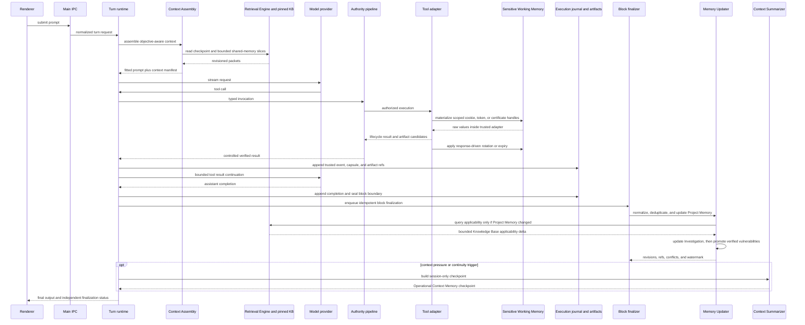

#### Before model invocation

The turn runtime:

1. resolves the project and durable session;
2. loads the latest checkpoint;
3. compares stored memory revisions with current revisions;
4. classifies the request objective and selected mode;
5. asks Context Assembly for bounded domain packets;
6. compiles prompt modules in Xekute's established order;
7. calculates the final prompt and response reserve;
8. exposes the context manifest to the UI.

Project Memory is never injected wholesale. The current `projectMemoryProjection()` behavior becomes a compatibility fallback until objective-aware retrieval is complete.

#### During tool execution

The authority pipeline remains the sole path to tool execution. After a tool returns:

1. output control bounds and sanitizes the model-facing result;
2. the tool adapter materializes authorized Sensitive Working Memory handles inside the trusted main-process execution path;
3. artifact projection records raw or expanded material in the appropriate project source under redaction policy;
4. the Sensitive Working Memory Manager applies trusted cookie, token, or certificate lifecycle changes from the response;
5. verification produces a trusted lifecycle result;
6. a context capsule records structured outcomes, opaque sensitive handles, and non-secret references;
7. the runtime immediately appends the trusted lifecycle event, capsule, and artifact references to the block journal;
8. the deterministic active-context reducer updates the in-block tool ledger without committing shared semantic memory;
9. only the bounded redacted result, safe provisional references, and execution status continue to the model.

A failed artifact or journal append must not be hidden by a successful tool result: it is a durability fault and the runtime must preserve or quarantine the uncommitted event before continuing. A later semantic projection failure must not falsely report tool failure. The final response reports `action_status` and `memory_finalization_status` independently.

#### At agent chat-block completion

The runtime appends the terminal assistant or stop record, seals the block's ordered event range, and durably enqueues one block-finalization job using `project_id + block_id + event_range_hash` as the logical idempotency key. The Memory Updater then:

1. normalizes and deduplicates the sealed block;
2. commits material Project Memory deltas;
3. calls Retrieval against the pinned Knowledge Base only when relevant Project Memory coverage inputs changed;
4. applies Investigation applicability deltas and direct execution deltas;
5. promotes verification-gated low-critical vulnerabilities to Evidence Memory;
6. completes or durably queues cross-memory outbox work;
7. publishes the project finalization watermark and committed references.

The UI may receive the final assistant response while optional background finalization continues, but the execution journal and finalization job must already be durable. A subsequent context assembly observes the watermark policy and cannot silently treat a partially finalized predecessor as current.

Sensitive Working Memory is checkpointed independently by its protected manager and is never passed through the summarizer. The Context Summarizer runs afterward only if its independent pressure or continuity trigger is active. Incomplete blocks and partial assistant output remain in the exact session transcript; they may be recovered and finalized with terminal state `failed`, `cancelled`, or `interrupted` without inventing a successful outcome.

#### Crash and restart recovery

Xekute already persists encrypted context-finalization jobs and reconciles durable processes. The target recovery sequence is:

1. verify event-log segments and snapshot manifests;
2. recover primary files from valid backups when required;
3. replay unapplied events after the last snapshot revision;
4. resume incomplete outbox operations idempotently;
5. process durable context-finalization jobs;
6. validate encrypted Sensitive Working Memory containers and invalidate undecryptable or expired handles without exposing payloads;
7. reconcile running or detached process records;
8. mark stale graph and SQLite read models for worker rebuild;
9. expose recovery warnings without blocking unaffected project reads.

### Multi-agent coordination

Shared memory coordinates agents; conversation copying does not.

#### Dispatch packet

A specialist agent receives:

- a declared objective and completion criteria;
- allowed tool and authority profile;
- target and investigation references;
- bounded Project Memory and graph slices;
- relevant procedure sections under a knowledge lease;
- source memory revisions;
- artifact access limits;
- optional opaque Sensitive Working Memory use leases scoped to exact origins and operations;
- expected structured return contract.

It does not receive the parent agent's entire transcript, unrestricted shared memory, raw cookies, tokens, certificate keys, or the parent's complete sensitive store.

#### Assignment leases

Investigation assignments use leases to reduce duplicate work. A lease identifies the investigation, test case, agent, creation time, heartbeat, and expiration. Lease expiry makes work claimable again but does not discard attempts already recorded.

Leases coordinate effort only. They do not grant network, file, identity, or technique authority; those remain controlled by the runtime authority profile.

#### Concurrent writes

Shared memory writes use expected revisions and idempotency keys. The coordinator may automatically retry only when mutations touch independent records and domain rules prove the merge safe. Competing updates to the same claim, investigation state, or finding produce an explicit conflict result.

#### Specialist return

Specialists return structured attempt outcomes, artifact references, proposed project facts, finding candidates, blockers, and remaining work. The parent receives committed references and a concise summary. It does not promote a specialist's prose directly into canonical memory.

### Operational limits and maintenance

The current v1 Project Memory caps arrays and drops older entries beyond fixed limits. The target architecture must avoid silent semantic loss.

#### Bounded reads, unbounded logical history

- Query responses are bounded and paginated.
- Snapshots contain bounded current state plus archive references.
- Event history rotates into immutable segments.
- Large attempt histories are archived by investigation and time.
- Artifact retention follows project policy.
- Derived indexes may prune caches, never canonical records.
- Any retention deletion produces a tombstone and audit record when policy permits history of the deletion.

#### Maintenance operations

Project maintenance includes:

- verify event and artifact hashes;
- validate cross-memory references;
- rebuild snapshots from events;
- rebuild the SQLite retrieval index;
- rebuild graph projections;
- detect orphaned artifacts;
- compact event segments without changing semantic history;
- apply retention policy;
- purge expired, revoked, orphaned, or session-deleted Sensitive Working Memory payloads without logging raw values;
- verify that sensitive handles resolve only within their owning project, session, agent, and allowed delegation leases;
- migrate old schema versions;
- export a portable manifest and integrity report.

Maintenance runs in worker threads or bounded background jobs where appropriate. It reports progress through Xekute's existing process-monitoring and UI event mechanisms.

#### Degraded operation

If SQLite or a graph projection is unavailable, canonical record reads continue through slower bounded file queries. If a snapshot is corrupt but events are valid, Xekute rebuilds the snapshot. If canonical events are corrupt, the memory enters read-only recovery mode and reports the first invalid segment rather than silently continuing with uncertain state.

If protected secret encryption is unavailable, semantic memories and Operational Context Memory may continue according to their normal fallback policy, but Sensitive Working Memory becomes process-only. If an encrypted sensitive container cannot be decrypted after restart, Xekute invalidates its handles and requires re-authentication; it never falls back to plaintext persistence.

### Compatibility and migration strategy

Migration must be additive, idempotent, previewable, and non-destructive. Existing files are never edited or removed merely because they have been imported.

#### Project Memory v1 mapping

The current `.xekute/context/project-memory.json` fields map as follows:

| v1 field | Target destination |
|---|---|
| `current.targetSummary` | Derived Project Memory overview; imported as attributed legacy summary |
| `current.scopeSummary` | Scope projection referencing the protected Project Profile |
| `current.assessmentPhase` | Investigation programme state |
| `current.importantEntities` | Candidate Project Memory entities and claims |
| `activeHypothesis` | Investigation Memory hypothesis |
| `observations` | Candidate Project Memory claims when factual; otherwise Investigation observations |
| `findings` | Verified low-critical records may be proposed for Evidence Memory after validation; candidates, informational items, and ambiguous legacy findings remain in Investigation Memory and are never automatically upgraded |
| `completedWork`, `completedPlans`, `completedRuns` | Investigation/run history and Session checkpoint references |
| `failures`, `negativeResults`, `knownGaps` | Investigation Memory |
| `evidenceRefs` | Artifact registry references |
| `relationships` | Candidate typed graph relationships with legacy provenance |
| `anomalies` | Investigation observations or graph anomalies |
| `decisions` | Operator requirements, session decisions, or Project claims depending on attribution |

Migration records the original file hash, schema version, import time, and mapping warnings. Ambiguous items remain `legacy_unclassified` until explicitly resolved.

Migration never extracts reusable cookies, authorization headers, bearer tokens, certificate private keys, or credentials from historical transcripts, logs, summaries, findings, or traffic and places them into Sensitive Working Memory automatically. Existing raw material remains governed by its source artifact and redaction policy. A new sensitive session is populated only by a fresh trusted browser/request observation, Identity Vault materialization, or explicit operator-authorized import.

#### Existing assessment sources

The migration indexer also consumes existing:

- engagement and scope JSON;
- enumeration endpoints, assets, pages, and subdomains;
- vulnerability-scan service and severity files;
- traffic JSONL;
- evidence indexes and runtime evidence;
- findings files;
- WSTG, ASVS, MITRE, and coverage files;
- run records;
- agent action and hypothesis logs;
- traffic graph snapshots and legacy Map output.

Source files remain authoritative for their legacy workflow until the corresponding target store is fully enabled. Dual-read compatibility should precede dual-write, and dual-write should precede cutover.

### Sequential implementation plan and cutover gates

Implementation proceeds in the following order. A phase may begin exploratory work early, but it cannot become the authoritative write path until the previous phase's exit gate passes. Every phase ships behind a feature flag and retains a rollback path to the preceding reader or writer until cutover.

| Phase | Implementation deliverable | Required exit gate |
|---:|---|---|
| 0 | **Architecture and contract freeze:** approve this document; define terminology, ownership, block boundaries, record envelopes, stable IDs, sensitivity classes, and test fixtures. | Contract tests prove that representative information has exactly one owner and illegal cross-domain writes are rejected. |
| 1 | **Durability foundation:** common canonical store utilities, atomic JSON/JSONL operations, artifact registry, execution-event journal, block IDs, finalization jobs, per-project queue, outbox, and watermark. | Crash/restart, partial-tail, idempotent retry, stale revision, and project-isolation tests pass without semantic stores enabled. |
| 2 | **Project Memory v2:** field-complete entity, claim, relationship, provenance, conflict, freshness, normalization, mutation, and bounded-read contracts; v1 compatibility reader and preview importer. | The same trusted block replay produces the same snapshot and IDs; duplicates do not advance revision; contradictions are disputed; no hypothesis or secret can enter Project Memory. |
| 3 | **Block reducer and Project updater:** deterministic capsule validation, traffic/tool clustering, material-delta detection, Project Memory projection, block finalizer, and finalization status reporting. | One completed block causes at most one logical finalization; internal tool loops do not write semantic snapshots; repeated events are coalesced; recovery replay is equivalent. |
| 4 | **Knowledge Base releases and Retrieval core:** immutable package ingestion, release pinning, catalogue and section queries, leases, token caps, revision manifests, and applicability query contracts. | A pinned release reproduces identical ordered results; stale cursors and invalid procedure IDs fail explicitly; full-corpus injection is impossible through normal APIs. |
| 5 | **Investigation Memory:** applicability selection/materialization plus the direct execution channel for attempts, negative results, blockers, coverage, candidates, assignments, and remaining work. | A Project delta updates checklist applicability through Retrieval; a no-new-fact tool block still updates attempts and coverage; retries never double-count; completed history is never silently removed. |
| 6 | **Evidence Memory:** verification gate, confirmed-finding identity, proof lineage, impact, remediation, retest, duplicate, accepted-risk, and report projections. | Only verified low-critical vulnerabilities can be created; candidates, informational results, failed verification, and raw secrets are rejected; cross-memory promotion recovers idempotently after a crash. |
| 7 | **Sensitive Working Memory:** protected container, browser-grade cookie jar, token and certificate lifecycle, vault references, opaque handles, tool-only materialization, scoped leases, and process-only degradation. | Same-block rotation works; no plaintext fallback exists; raw values are absent from prompts, transcripts, logs, graphs, semantic memories, reports, and unauthorized IPC responses. |
| 8 | **Operational Context Memory:** exact transcript boundary integration, deterministic tool-event ledger, schema-constrained conversation synopsis, checkpoint transaction, pressure policy, recent tail, and deterministic fallback. | Ordinary block completion does not summarize; pressure-triggered compression preserves required state and exact transcript; no raw sensitive value or unsupported fact enters a checkpoint. |
| 9 | **Context Assembly:** objective classification, revision and watermark checks, bounded multi-memory retrieval, active budget allocation, recent-tail composition, and pending-finalization handling. | The next block never silently uses partially finalized state; packets remain within token limits; whole Project Memory and whole Knowledge Base dumps are absent. |
| 10 | **Derived intelligence views:** SQLite search/index projections, unified Knowledge Graph, and compatibility projection to the existing deterministic traffic Map. | Deleting and rebuilding derived stores from canonical records yields equivalent query results; derived writes cannot create semantic truth. |
| 11 | **Multi-agent coordination:** dispatch packets, assignment leases, specialist event returns, optimistic concurrency, sensitive-handle non-inheritance, and handoff/resume behavior. | Concurrent blocks converge without lost updates or duplicate attempts; unauthorized handle transfer and cross-project references are rejected. |
| 12 | **UI, observability, and operator controls:** memory explorer, context inspector, provenance/conflict views, coverage, finalization health, migration preview, recovery warnings, and redacted audit surfaces. | The operator can distinguish action, durability, semantic-finalization, projection, summarization, and sensitive-store status without exposing protected values. |
| 13 | **Migration and dual-write cutover:** additive import of legacy Project Memory, traffic, Map, evidence, findings, runs, and coverage; dual-read, shadow comparison, then dual-write. | Fixture parity, warning review, rollback, and user-visible migration verification pass; no legacy candidate is silently upgraded to a verified fact or finding. |
| 14 | **Legacy retirement and hardening:** stop obsolete writers, remove compatibility fallback only after telemetry and soak testing, tune pressure and retention, and complete security/performance review. | No supported project depends on v1 writes; backup restore and downgrade policy are documented; full end-to-end suite and threat-model review pass. |

The detailed design sequence begins with the **Project Memory write contract**: trusted source classes, entity keys, predicates, relationship types, deduplication, contradictions, freshness, and mutation results. The remaining phases must consume those contracts rather than redefining Project Memory ad hoc.

### Verification and test strategy

The architecture requires executable invariants, not documentation alone.

#### Domain contract tests

Test:

- ID stability and project isolation;
- canonical normalization;
- legal and illegal lifecycle transitions;
- exact merge versus ambiguous match behavior;
- claim conflict and supersession;
- material-delta detection and no-op revision behavior;
- scoped negative-result semantics;
- dual-channel Investigation merge order and idempotency;
- finding verification thresholds and low-critical severity restriction;
- immutable Knowledge Base releases;
- selection-buffer partial success and no auto-correction.

#### Storage tests

Test:

- atomic replacement and backup recovery;
- partial JSONL tail recovery;
- event replay equivalence with snapshots;
- idempotent retries;
- stale revision conflicts;
- outbox restart recovery;
- block sealing, event-range integrity, finalization queue ordering, and watermark recovery;
- schema migration idempotency;
- hash and artifact source-position validation;
- safeStorage and fallback behavior;
- mandatory-encryption behavior for Sensitive Working Memory with no plaintext fallback;
- cookie, token, certificate, and vault-reference rotation, expiry, revocation, deletion, and restart recovery;
- cross-project, cross-session, and cross-agent sensitive-handle rejection;
- project move without project-ID change.

#### Compression fidelity tests

Construct long multi-day transcripts containing repeated tools, partial failures, operator constraints, active processes, findings, knowledge leases, and concurrent appended messages. Verify that:

- the exact transcript is unchanged;
- required capsule records survive;
- authoritative transitions commit before activation;
- unsupported assistant prose does not become fact;
- failures and unresolved work remain visible;
- knowledge bodies expire but references remain;
- recent appended messages are merged exactly once;
- resumed context detects stale shared revisions;
- deterministic fallback succeeds without a model;
- ordinary block completion alone does not create a checkpoint;
- the deterministic tool ledger preserves security-relevant traffic variants while coalescing repetition;
- no raw Sensitive Working Memory value enters the summary input, checkpoint, recent tail, or fallback Markdown.

#### Retrieval tests

Verify stable ordering, pagination, token caps, sensitivity filtering, revision reporting, stale cursors, deleted records, graph hop limits, cross-project rejection, bounded artifact expansion, material-change-gated Knowledge Base applicability queries, and rejection of generic attempts to query Sensitive Working Memory raw values.

#### Security tests

Verify prompt-injection resistance for stored artifacts and imported memory, secret redaction, identity-vault reference handling, unauthorized IPC rejection, scope non-expansion, audit records for protected reads, safe rendering in the UI, absence of raw secrets from transcripts and logs, tool-only materialization, process-only degradation, handle lease expiry, and non-inheritance by subagents.

#### Migration tests

Use fixtures from every supported legacy schema. Compare pre- and post-migration counts, source references, verification states, graph links, and warnings. A migration must never turn a hypothesis, assistant statement, or legacy summary into a verified project claim or verified finding.

#### End-to-end acceptance scenarios

At minimum, validate:

1. a fresh project moving from profile setup through traffic ingestion, investigation selection, verification, compression, restart, and report generation;
2. a migrated project with existing traffic, findings, Map snapshots, and long chat history;
3. two agents working concurrently on overlapping endpoint investigations;
4. a crash during cross-memory finding promotion;
5. a project moved to a different directory or drive;
6. a corrupted derived index rebuilt from canonical sources;
7. a scope change that blocks active work without deleting investigation history;
8. a Knowledge Base upgrade that preserves old investigation reproducibility;
9. an authenticated browser session whose cookies rotate, survive an authorized encrypted restart, replay through opaque handles, and disappear after logout or session deletion;
10. a mutual-TLS workflow using a session client-certificate chain and an Identity Vault private-key reference without exposing the key to the model;
11. a long tool loop that persists artifacts and rotated credentials immediately but creates only one semantic block finalization;
12. a completed block with no new target fact that leaves Project Memory unchanged while updating Investigation attempts and coverage;
13. a crash after Project Memory commit but before Investigation and Evidence transitions, recovered through the outbox without duplication;
14. a new user prompt arriving while the previous block is still finalizing, with Context Assembly honoring the project watermark instead of silently using stale state.


## SECTION F — SUMMARY AND CONCLUSION

This section consolidates the architecture's fixed decisions, non-negotiable invariants, remaining detailed design work, and final operating model.

### Architecture decisions fixed by this overview

The following decisions should be treated as the baseline unless a later subsystem design explicitly revises this document:

- Xekute remains local-first and project-portable.
- Exact transcripts and compressed checkpoints are separate records.
- Memory updating and context summarization are independent systems with non-overlapping write authority.
- One agent chat block spans a user prompt through all agent/tool loops until control returns to the user.
- Exact transcript, artifacts, trusted execution events, and live sensitive-state changes persist incrementally during the block.
- The deterministic Memory Updater runs once logically after every completed block and advances a memory revision only for a material delta.
- Project Memory receives evidence-backed target knowledge; a material Project delta triggers bounded Knowledge Base applicability retrieval.
- Investigation Memory has an applicability path from Project Memory plus Knowledge Base and a direct execution path for attempts and coverage.
- Evidence Memory contains only verification-gated low-critical vulnerabilities; candidates and informational observations stay outside it.
- Agent Session Memory contains Operational Context Memory and Sensitive Working Memory as separate subcategories.
- The Context Summarizer writes only Operational Context Memory and is not triggered by ordinary block completion alone.
- Tool-event context is deterministically reduced; only the conversation synopsis may use schema-constrained model synthesis.
- Sensitive Working Memory stores live raw authentication state only in protected encrypted or process-only storage and exposes it to tools through opaque handles.
- The Project Profile remains authoritative for scope and authorization.
- The five semantic memory domains retain single ownership.
- Raw artifacts remain outside semantic memory.
- JSON/JSONL canonical stores and immutable events remain human-inspectable.
- SQLite and graph stores are rebuildable read models.
- Context packets are bounded, revision-aware, and objective-specific.
- Project facts require provenance; findings require verification.
- The Knowledge Graph is derived and federated across canonical records.
- Knowledge Base releases are immutable and investigations pin a release.
- Current Xekute stores and tools migrate through compatibility adapters.
- No memory or retrieval operation can broaden runtime authority.

### Architectural invariants

The following rules define the architecture and must remain true as the detailed schemas are developed:

1. Every information class has one authoritative owner.
2. Agent Session Memory is never authoritative for project facts, investigation state, or findings; Sensitive Working Memory is authoritative only for the current session's usable secret state.
3. Context summarization cannot create truth; it can only preserve operational context and references to authoritative truth.
4. Project facts are not accepted without provenance and an explicit lifecycle state.
5. Unverified vulnerability hypotheses remain in Investigation Memory.
6. Evidence Memory contains only confirmed vulnerabilities with severity `low`, `medium`, `high`, or `critical`; candidates, rejected or inconclusive verification, and informational observations remain in Investigation or Project Memory.
7. Raw artifacts are stored outside semantic memory and referenced by stable identifiers.
8. Knowledge Base versions are immutable and investigations pin the version they use.
9. The Knowledge Graph is derived from canonical records and cannot become a second source of truth.
10. Shared project memories are revisioned, auditable, and safe for concurrent agent access.
11. Cross-project references and retrieval are rejected unless explicitly supported by an authorized higher-level scope.
12. Retrieval returns bounded, source-identified, revision-aware context rather than unrestricted memory dumps.
13. Historical changes are superseded, retracted, or archived through explicit lifecycle transitions rather than silent overwrite.
14. Secret and sensitive values are excluded from general memory, prompts, logs, indexes, graphs, and reports; the narrow Sensitive Working Memory exception uses encrypted or process-only storage.
15. Project Profile scope and authorization always override memory, graph, investigation, or session state.
16. Compression never edits or deletes the exact durable session transcript.
17. The Memory Updater never writes Agent Session Memory or summarizes conversation.
18. The Context Summarizer never reads raw Sensitive Working Memory payloads and never writes Sensitive Working Memory, Project Memory, Investigation Memory, Evidence Memory, Knowledge Base Memory, graph, or artifact truth.
19. Sensitive Working Memory never uses a plaintext persistence fallback.
20. Raw Sensitive Working Memory values are materialized only inside authorized trusted tool adapters.
21. Sensitive handles are bound to project, session, agent, origin, identity, expiry, and delegation policy.
22. Subagents and successor sessions never inherit sensitive handles without an explicit bounded use lease or transfer.
23. Long-lived credentials and private keys remain Identity Vault-owned; promotion from session state is explicit and never automatic.
24. Internal tool calls and model continuations append durable execution state but do not independently materialize Project, Investigation, or Evidence Memory.
25. Every terminal agent chat block has one logical idempotent semantic finalization operation, including failed, cancelled, and interrupted blocks with trustworthy partial results.
26. Project Memory advances only for a material accepted target-knowledge delta; duplicate observations never create duplicate entities or claims.
27. Investigation applicability may depend on Project Memory and Knowledge Base retrieval, but attempts, negative results, blockers, and coverage update directly from trusted execution events.
28. Knowledge Base applicability retrieval runs only for relevant material Project Memory changes or an explicit operator-requested refresh, not unconditionally after every block.
29. Evidence promotion occurs only after Investigation verification state satisfies the Evidence Memory gate.
30. The per-project finalization watermark prevents subsequent context assembly from silently treating partially finalized shared memory as current.
31. Context summarization is pressure- or continuity-triggered and never an automatic consequence of ordinary block completion.
32. Deterministic tool-event reduction retains failures and security-relevant variants and keeps raw traffic in the Artifact Store.

### Scope of this document

This document defines the overview, boundaries, ownership model, and information flow of the complete context-memory architecture.

It intentionally does not yet define:

- field-complete, versioned JSON Schemas for every record type;
- the final exhaustive entity, predicate, and relationship catalogues;
- per-predicate confidence, freshness, and verification policies;
- exact agent-tool and renderer-IPC contracts;
- final context-pressure percentages and token-allocation tuning;
- concrete SQLite tables, indexes, and graph snapshot schemas;
- concrete retention durations for each data classification;
- field-complete Sensitive Working Memory cookie, token, certificate, handle, and delegation schemas;
- exact secure-container provider and key-rotation mechanics;
- packaged Knowledge Base update and distribution mechanics.

Those areas will be designed one subsystem at a time, beginning with Project Memory, while preserving the boundaries and invariants established here.

### Conclusion

Xekute's target memory architecture uses five authoritative memory domains, one deterministic block-finalized Memory Updater, and one session-only Context Summarizer. Agent Session Memory is divided into summarized Operational Context Memory and encrypted Sensitive Working Memory for live cookies, tokens, certificates, and request-authentication state. During an agent chat block, Xekute incrementally preserves the exact transcript, raw artifacts, trusted execution events, and same-block secret rotation. At block completion, it performs one idempotent semantic finalization: evidence-backed target knowledge updates Project Memory; material Project changes drive bounded Knowledge Base applicability into Investigation Memory; direct execution events update attempts and coverage; and only verification-gated low-critical vulnerabilities enter Evidence Memory.

Context Summarization is a separate pressure- and continuity-driven process. It combines a schema-constrained conversation synopsis, a deterministic deduplicated tool-event ledger, a recent exact transcript tail, and revision-aware retrieved slices into the next active context. It never rewrites the exact transcript or creates semantic truth. Request and browser tools use opaque sensitive handles without placing raw secrets into ordinary model context, while the Knowledge Graph and SQLite indexes remain rebuildable views over canonical local records.

This design preserves Xekute's local-first and human-in-the-loop model: the Project Profile remains authoritative for scope and Rules of Engagement; the authority pipeline remains authoritative for execution; artifacts remain linked to provenance; findings remain verification-gated; exact transcripts remain intact; and no memory, graph, retrieval result, or summary can broaden authorization.

Implementation now follows the gated sequence in Section E. The next subsystem design is the complete Project Memory schema and write contract—trusted source classes, canonical entity keys, predicates, relationships, deduplication, contradiction handling, freshness, provenance, and mutation results—built on the minimal durability contracts required by Phases 0 and 1.
