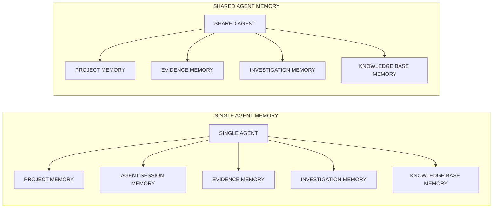

# CONTEXT MEMORY, COMPRESSION REVAMP AND RETRIEVAL ENGINE

This is a fully restructure engineering of the xekute's context memory management and how it's being compressed.

## MEMORY TYPES

1. Project memory
2. Agent session memory
3. Evidence memory
4. Investigation memory
5. Knowledge base memory

## HIGH-LEVEL OVERVIEW OF HOW THE MEMORY WORKS



In short these memories solves:

Knowledge Memory
= What techniques exist?

Project Memory
= What do we know about THIS application?

Investigation Memory
= Based on what we know,
  what should we test,
  what did we test,
  and how thoroughly?

Evidence Memory
= What vulnerabilities did we prove?

Agent Session Memory
= What does this agent need
  to continue its current conversation?


## MEMORY IN DEPTH

---

### PROJECT MEMORY

#### What is project memory?

> Project Memory basically stores the target's detailed informations as much as possible. Things like target url, ip, dns, domain, server type, technology in front-end, technology in backend, type of database it's using, cdn, waf, third_party_services, type of web application, type of authentication system, type of payment system, roles it has, how cookie and headers work, relationships, verified facts, findings, evidence references, status, severity etc etc.


#### Structure of project memory:

```JSON
{
  "schema_version": "1.0",
  "project_id": "proj_001",
  "updated_at": "2026-08-26T00:00:00Z",

  "target": {
    "primary_url": "https://example.com",

    "hosts": [
      {
        "hostname": "api.example.com",
        "ip_addresses": ["203.0.113.10"],
        "status": "active",
        "evidence_refs": ["ev_001"]
      }
    ],

    "subdomains": [
      {
        "hostname": "admin.example.com",
        "status": "active",
        "evidence_refs": ["ev_002"]
      }
    ]
  },

  "technology": {
    "frontend": [
      {
        "name": "React",
        "version": null,
        "evidence_refs": ["ev_003"]
      }
    ],

    "backend": [
      {
        "name": "Express",
        "version": "4.x",
        "evidence_refs": ["ev_004"]
      }
    ],

    "server": [
      {
        "name": "nginx",
        "version": "1.24",
        "evidence_refs": ["ev_005"]
      }
    ],

    "database": [],
    "waf": [],
    "cdn": [],
    "third_party_services": []
  },

  "application": {
    "architecture": {
      "type": "spa",
      "evidence_refs": ["ev_006"]
    },

    "authentication": {
      "present": true,

      "mechanisms": [
        {
          "type": "jwt",
          "evidence_refs": ["ev_007"]
        }
      ]
    },

    "roles": [
      {
        "role_id": "role_user",
        "name": "user",
        "evidence_refs": ["ev_008"]
      },

      {
        "role_id": "role_admin",
        "name": "admin",
        "evidence_refs": ["ev_009"]
      }
    ]
  },

  "endpoints": [
    {
      "endpoint_id": "endpoint_001",

      "host": "api.example.com",
      "method": "GET",
      "path": "/api/users/{id}",

      "authentication_required": true,

      "parameters": [
        {
          "name": "id",
          "location": "path",
          "type": "integer"
        }
      ],

      "observed_behavior": [
        "Returns user profile information"
      ],

      "evidence_refs": ["ev_010"]
    }
  ],

  "forms": [],

  "cookies": [
    {
      "name": "session",
      "purpose": "authentication",
      "secure": true,
      "http_only": true,
      "same_site": "Lax",
      "evidence_refs": ["ev_011"]
    }
  ],

  "tokens": [
    {
      "token_id": "token_001",
      "type": "jwt",
      "algorithm": "RS256",
      "usage": "access_token",
      "evidence_refs": ["ev_012"]
    }
  ],

  "verified_facts": [
    {
      "fact_id": "fact_001",

      "category": "authentication",

      "statement": "The application uses JWT bearer authentication.",

      "evidence_refs": [
        "ev_007",
        "ev_012"
      ],

      "discovered_by": "agent_auth_01"
    }
  ],

  "important_negative_knowledge": [
    {
      "negative_id": "neg_001",

      "subject": "JWT signature validation",

      "statement": "Unsigned JWTs were rejected during completed testing.",

      "evidence_refs": ["ev_020"]
    }
  ],

  "relationships": [
    {
      "relationship_id": "rel_001",

      "from": "endpoint_001",
      "type": "USES_ROLE",
      "to": "role_user",

      "evidence_refs": ["ev_021"]
    }
  ]
}
```

#### What should not be in the file:

Raw HTTP responses
Huge Nmap output
Browser dumps
screenshots
every payload attempted
current agent reasoning
hypotheses
current TODOs
"try X next"
entire conversation summaries

---

### AGENT SESSION MEMORY

#### What is agent session memory?

> Agent session memory is a much more temporary and operational. Basically it'll have what the current agent needs to remember so it can continue it's investigation intelligently without reading the whole conversation again and again.

#### Structure of agent session memory

```JSON
{
  "agent_id": "agent_001",
  "session_id": "session_001",

  "compressed_context": {
    "summary": "...",

    "grounded_truths": [
      {
        "fact": "Application uses JWT authentication.",
        "evidence_refs": ["ev_102"]
      }
    ],

    "important_attempts": [
      {
        "summary": "Tested unsigned JWT; server rejected it.",
        "evidence_refs": ["ev_110"]
      }
    ],

    "current_state": "Investigating refresh-token invalidation after logout."
  },

  "latest_user_prompt": "Continue testing the authentication flow."
}
```

---

### EVIDENCE MEMORY

#### What is evidence memory

> Evidence Memory is the project-scoped store of verified security findings and the proof required to demonstrate those findings. Its purpose is not to describe the target generally. Its purpose is to answer What vulnerabilities have we actually proven exist? So Evidence Memory should contain things like the finding identity, vulnerability type, affected endpoint/parameter, severity, concise description, verification status, impact, proof references such as baseline vs exploit request/response, affected entities, CWE/OWASP classification, and who/what verified it.

#### Structure of evidence memory

```JSON
{
  "schema_version": "1.0",
  "project_id": "proj_001",
  "updated_at": "2026-08-26T00:00:00Z",

  "findings": [
    {
      "finding_id": "finding_001",

      "title": "Horizontal IDOR in user profile endpoint",

      "type": "idor",

      "category": "broken_access_control",

      "status": "verified",

      "severity": "high",

      "confidence": "confirmed",

      "target": {
        "host": "api.example.com",
        "method": "GET",
        "endpoint": "/api/users/{id}",
        "parameter": "id"
      },

      "description": "A normal authenticated user can retrieve profile information belonging to another user by changing the user ID.",

      "proof": {
        "baseline": {
          "request_ref": "artifact_101",
          "response_ref": "artifact_102"
        },

        "exploit": {
          "request_ref": "artifact_103",
          "response_ref": "artifact_104"
        }
      },

      "verification": {
        "verified": true,

        "verification_method": "cross-account comparison",

        "verified_by": "agent_access_control_01",

        "verification_refs": [
          "artifact_101",
          "artifact_102",
          "artifact_103",
          "artifact_104"
        ]
      },

      "impact": {
        "summary": "Authenticated users can access other users' private profile information."
      },

      "affected_entities": [
        "endpoint_001"
      ],

      "classification": {
        "cwe": "CWE-639",
        "owasp": "A01:2021-Broken Access Control"
      },

      "discovered_at": "2026-08-26T00:00:00Z",
      "updated_at": "2026-08-26T00:00:00Z"
    }
  ]
}
```

#### What should not be in this file

General target information like frameworks, hosts, endpoints, roles, cookies, or architecture → Project Memory
Unverified suspicions like “maybe SQLi” or “possible IDOR” → Agent Session / Investigation Memory
Every payload or failed attempt → Investigation Memory
TODOs or next actions → Investigation Memory
Agent reasoning or conversation history → Session Memory
Generic pentesting instructions or OWASP methodology → Knowledge Memory
Huge unrelated raw tool outputs
Recon results that don't establish a vulnerability
Findings that have not passed your verification threshold

### INVESTIGATION MEMORY

#### What is investigation memory?
> The dynamic project-scoped state that tracks what security testing should be performed, why it applies, how deeply it has been tested, what has already been attempted, and what remains to investigate.

#### Structure of investigation memory

```JSON
{
  "schema_version": "1.0",

  "project_id": "proj_001",

  "revision": 7,

  "updated_at": "2026-08-26T10:00:00Z",

  "knowledge_base": {
    "name": "OWASP-WSTG",
    "version": "latest",
    "content_hash": "sha256:..."
  },

  "generated_from": {
    "project_memory_revision": 12,
    "selection_session_id": "sel_0042",

    "selected_indexes": [
      "WSTG-INFO-01",
      "WSTG-INFO-02",
      "WSTG-ATHN-01"
    ]
  },

  "coverage": {
    "total_investigations": 3,
    "pending": 2,
    "in_progress": 1,
    "completed": 0,
    "blocked": 0,
    "not_applicable": 0
  },

  "investigations": {
    "WSTG-INFO-01": {
      "index_id": "WSTG-INFO-01",

      "status" : "DONE",
      
      "title": "Conduct Search Engine Discovery Reconnaissance for Information Leakage",

      "summary" : "In order for search engines to work, computer programs (or robots) regularly fetch data (referred to as crawling) from billions of pages on the web. These programs find web content and functionality by following links from other pages, or by looking at sitemaps. If a site uses a special file called robots.txt to list pages that it does not want search engines to fetch, then the pages listed there will be ignored. This is a basic overview - Google offers a more in-depth explanation of how a search engine works. Testers can use search engines to perform reconnaissance on sites and web applications. There are direct and indirect elements to search engine discovery and reconnaissance: direct methods relate to searching the indices and the associated content from caches, while indirect methods relate to learning sensitive design and configuration information by searching forums, newsgroups, and tendering sites. Once a search engine robot has completed crawling, it commences indexing the web content based on tags and associated attributes, such as <TITLE>, in order to return relevant search results. If the robots.txt file is not updated during the lifetime of the site, and in-line HTML meta tags that instruct robots not to index content have not been used, then it is possible for indices to contain web content not intended to be included by the owners. Site owners may use the previously mentioned robots.txt, HTML meta tags, authentication, and tools provided by search engines to remove such content.",
      "test_objectives" : "Identify what sensitive design and configuration information of the application, system, or organization is exposed directly (on the organization’s site) or indirectly (via third-party services).",
      "how_to_test" : "Use a search engine to search for potentially sensitive information. This may include:network diagrams and configurations archived posts and emails by administrators or other key staff; logon procedures and username formats; usernames, passwords, and private keys; third-party, or cloud service configuration files; revealing error message content; and non-public applications (development, test, User Acceptance Testing (UAT), and staging versions of sites).",
      "search_engines" : "Do not limit testing to just one search engine provider, as different search engines may generate different results. Search engine results can vary in a few ways, depending on when the engine last crawled content, and the algorithm the engine uses to determine relevant pages. Consider using the following (alphabetically listed) search engines: Baidu, China’s most popular search engine. Bing, a search engine owned and operated by Microsoft, and the second most popular worldwide. Supports advanced search keywords. binsearch.info, a search engine for binary Usenet newsgroups. Common Crawl, “an open repository of web crawl data that can be accessed and analyzed by anyone.” DuckDuckGo, a privacy-focused search engine that compiles results from many different sources. Supports search syntax. Google, which offers the world’s most popular search engine, and uses a ranking system to attempt to return the most relevant results. Supports search operators. Internet Archive Wayback Machine, “building a digital library of internet sites and other cultural artifacts in digital form.” Censys is a security-focused search engine that indexes internet-connected infrastructure including servers, certificates,and open services. It offers a free community tier with limited monthly credits and paid plans for enterprise use. Shodan, a service for searching internet-connected devices and services. Usage options include a limited free plan as well as paid subscription plans.",
      "search_operators" : "A search operator is a special keyword or syntax that extends the capabilities of regular search queries, and can help obtain more specific results. They generally take the form of operator:query. Here are some commonly supported search operators: site: will limit the search to the provided domain. inurl: will only return results that include the keyword in the URL. intitle: will only return results that have the keyword in the page title. intext: or inbody: will only search for the keyword in the body of pages. filetype: will match only a specific file type, i.e. .png, or .php. , Internet Archive Wayback Machine : The Internet Archive Wayback Machine is the most comprehensive tool for viewing historical snapshots of web pages. It maintains an extensive archive of web pages dating back to 1996. To view archived versions of a site, visit https://web.archive.org/web/*/ followed by the target URL: https://web.archive.org/web/*/owasp.org This will display a calendar view showing all available snapshots of the site over time. Other Cached Content Services Additional services for viewing cached or archived web pages include: archive.ph (also known as archive.md) - On-demand archiving service that creates permanent snapshots CachedView - Aggregates cached pages from multiple sources including Google Cache historical data, Wayback Machine, and others",
      "Google Hacking or Dorking" : "Searching with operators can be a very effective discovery technique when combined with the creativity of the tester. Operators can be chained to effectively discover specific kinds of sensitive files and information. This technique, called Google hacking or Dorking, is also possible using other search engines, as long as the search operators are supported. A database of dorks, like the Google Hacking Database, is a useful resource that can help uncover specific information. AI-assisted query generators such as DorkGPT can translate natural language prompts into Google dork syntax, reducing the manual effort of constructing complex search operators. Some categories of dorks available on this database include: Footholds Files containing usernames Sensitive Directories Web Server Detection Vulnerable Files Vulnerable Servers Error Messages Files containing juicy info Files containing passwords Sensitive Online Shopping Info",
      "OSINT Correlation Tools" : "Beyond individual search engines, testers can use dedicated OSINT frameworks to correlate and visualize relationships between discovered entities: Maltego is an industry-standard OSINT and link analysis platform that maps relationships between domains, IP addresses, email addresses, and organizations through automated data transforms. Testers use it to visualize an organization’s attack surface by pivoting from a single entity to discover related infrastructure and associated data points. A free Community Edition is available for non-commercial use.",
      "Remediation":""
    }
  }
}
```
---

### KNOWLEDGE BASE MEMORY

#### What is knowledge base memory
Knowledge base is a storage based memory, not an in-active memory. It follows the latest WSTG guide. Basically it's the full collection of WSTG set to test a website from top to bottom.

#### Structure of Knowledge base memory
reference : [WSTG](https://owasp.org/www-project-web-security-testing-guide/latest/4-Web_Application_Security_Testing/)

```JSON
{
    "Overview" : {
        "INFORMATION GATHERING" : [
            "WSTG-INFO-01" : "",
            "WSTG-INFO-02" : "",
            "WSTG-INFO-03" : "",
            "WSTG-INFO-04" : "",
            "WSTG-INFO-05" : "",
            "WSTG-INFO-06" : "",
            "WSTG-INFO-07" : "",
            "WSTG-INFO-08" : "",
            "WSTG-INFO-09" : "",
            "WSTG-INFO-10" : ""
        ],
        "Configuration and Deployment Management Testing" : [
            "WSTG-CONF-01" : "",
            "WSTG-CONF-02" : "",
            "WSTG-CONF-03" : "",
            "WSTG-CONF-04" : "",
            "WSTG-CONF-05" : "",
            "WSTG-CONF-06" : "",
            "WSTG-CONF-07" : "",
            "WSTG-CONF-08" : "",
            "WSTG-CONF-09" : "",
            "WSTG-CONF-10" : "",
            "WSTG-CONF-11" : "",
            "WSTG-CONF-12" : "",
            "WSTG-CONF-13" : "",
            "WSTG-CONF-14" : ""
        ]
    },
    "Details" : {
        "Information Gathering" : {
            "WSTG-INFO-01" : {
                "summary" : "In order for search engines to work, computer programs (or robots) regularly fetch data (referred to as crawling) from billions of pages on the web. These programs find web content and functionality by following links from other pages, or by looking at sitemaps. If a site uses a special file called robots.txt to list pages that it does not want search engines to fetch, then the pages listed there will be ignored. This is a basic overview - Google offers a more in-depth explanation of how a search engine works. Testers can use search engines to perform reconnaissance on sites and web applications. There are direct and indirect elements to search engine discovery and reconnaissance: direct methods relate to searching the indices and the associated content from caches, while indirect methods relate to learning sensitive design and configuration information by searching forums, newsgroups, and tendering sites. Once a search engine robot has completed crawling, it commences indexing the web content based on tags and associated attributes, such as <TITLE>, in order to return relevant search results. If the robots.txt file is not updated during the lifetime of the site, and in-line HTML meta tags that instruct robots not to index content have not been used, then it is possible for indices to contain web content not intended to be included by the owners. Site owners may use the previously mentioned robots.txt, HTML meta tags, authentication, and tools provided by search engines to remove such content.",
                "test_objectives" : "Identify what sensitive design and configuration information of the application, system, or organization is exposed directly (on the organization’s site) or indirectly (via third-party services).",
                "how_to_test" : "Use a search engine to search for potentially sensitive information. This may include:network diagrams and configurations archived posts and emails by administrators or other key staff; logon procedures and username formats; usernames, passwords, and private keys; third-party, or cloud service configuration files; revealing error message content; and non-public applications (development, test, User Acceptance Testing (UAT), and staging versions of sites).",
                "search_engines" : "Do not limit testing to just one search engine provider, as different search engines may generate different results. Search engine results can vary in a few ways, depending on when the engine last crawled content, and the algorithm the engine uses to determine relevant pages. Consider using the following (alphabetically listed) search engines: Baidu, China’s most popular search engine. Bing, a search engine owned and operated by Microsoft, and the second most popular worldwide. Supports advanced search keywords. binsearch.info, a search engine for binary Usenet newsgroups. Common Crawl, “an open repository of web crawl data that can be accessed and analyzed by anyone.” DuckDuckGo, a privacy-focused search engine that compiles results from many different sources. Supports search syntax. Google, which offers the world’s most popular search engine, and uses a ranking system to attempt to return the most relevant results. Supports search operators. Internet Archive Wayback Machine, “building a digital library of internet sites and other cultural artifacts in digital form.” Censys is a security-focused search engine that indexes internet-connected infrastructure including servers, certificates,and open services. It offers a free community tier with limited monthly credits and paid plans for enterprise use. Shodan, a service for searching internet-connected devices and services. Usage options include a limited free plan as well as paid subscription plans.",
                "search_operators" : "A search operator is a special keyword or syntax that extends the capabilities of regular search queries, and can help obtain more specific results. They generally take the form of operator:query. Here are some commonly supported search operators: site: will limit the search to the provided domain. inurl: will only return results that include the keyword in the URL. intitle: will only return results that have the keyword in the page title. intext: or inbody: will only search for the keyword in the body of pages. filetype: will match only a specific file type, i.e. .png, or .php. , Internet Archive Wayback Machine : The Internet Archive Wayback Machine is the most comprehensive tool for viewing historical snapshots of web pages. It maintains an extensive archive of web pages dating back to 1996. To view archived versions of a site, visit https://web.archive.org/web/*/ followed by the target URL: https://web.archive.org/web/*/owasp.org This will display a calendar view showing all available snapshots of the site over time. Other Cached Content Services Additional services for viewing cached or archived web pages include: archive.ph (also known as archive.md) - On-demand archiving service that creates permanent snapshots CachedView - Aggregates cached pages from multiple sources including Google Cache historical data, Wayback Machine, and others",
                "Google Hacking or Dorking" : "Searching with operators can be a very effective discovery technique when combined with the creativity of the tester. Operators can be chained to effectively discover specific kinds of sensitive files and information. This technique, called Google hacking or Dorking, is also possible using other search engines, as long as the search operators are supported. A database of dorks, like the Google Hacking Database, is a useful resource that can help uncover specific information. AI-assisted query generators such as DorkGPT can translate natural language prompts into Google dork syntax, reducing the manual effort of constructing complex search operators. Some categories of dorks available on this database include: Footholds Files containing usernames Sensitive Directories Web Server Detection Vulnerable Files Vulnerable Servers Error Messages Files containing juicy info Files containing passwords Sensitive Online Shopping Info",
                "OSINT Correlation Tools" : "Beyond individual search engines, testers can use dedicated OSINT frameworks to correlate and visualize relationships between discovered entities: Maltego is an industry-standard OSINT and link analysis platform that maps relationships between domains, IP addresses, email addresses, and organizations through automated data transforms. Testers use it to visualize an organization’s attack surface by pivoting from a single entity to discover related infrastructure and associated data points. A free Community Edition is available for non-commercial use.",
                "Remediation":""
            },
            "WSTG-INFO-02" : {
                "summary" : "",
                "test_objectives" : "",
                "how_to_test" : "",
                "banner_grabbing" : "",
                "Sending Malformed Requests" : "",
                "Using Automated Scanning Tools" : "",
                "Remediation" : ""
            }
        }
    }
}
```

### RETRIEVAL ENGINE

#### What is retrieval engine?
Retrieval engine is a deterministic engine that is the gate between the agent and the knowledge base. It gets the query from the agent and builds the investigation memory for the project. The investigation memory is built deterministically so no error is being passed.

#### Retrieval Engine internal selection state

While the parent agent is deciding what it wants, the retrieval engine maintains something like:

```JSON
{
  "selection_session_id": "sel_0042",

  "project_id": "proj_001",

  "knowledge_base_version": "latest",

  "status": "building",

  "selected_indexes": [
    "WSTG-INFO-01",
    "WSTG-INFO-02"
  ],

  "rejected_indexes": [
    {
      "submitted": "WSTF-AUTH-50",
      "reason": "index_not_found"
    }
  ],

  "revision": 4
}
```

#### Retrieval Engine tool catalogue

```JSON
{
  "retrieval_engine": {

    "dump_index": {
      "description": "Return the compact Knowledge Base overview containing available categories and index IDs.",

      "parameters": {
        "category": {
          "type": ["string", "null"],
          "required": false
        }
      }
    },

    "query_index": {
      "description": "Retrieve information about one valid Knowledge Base index without adding it to the active investigation selection.",

      "parameters": {
        "index_id": {
          "type": "string",
          "required": true
        },

        "detail_level": {
          "type": "string",
          "enum": [
            "overview",
            "full"
          ],
          "default": "overview"
        },

        "sections": {
          "type": "array",
          "items": {
            "type": "string"
          },
          "required": false
        }
      }
    },

    "add_index": {
      "description": "Validate and add one or more Knowledge Base indexes to the active investigation selection.",

      "parameters": {
        "index_ids": {
          "type": "array",
          "items": {
            "type": "string"
          },
          "required": true
        }
      }
    },

    "remove_index": {
      "description": "Remove one or more indexes from the active investigation selection.",

      "parameters": {
        "index_ids": {
          "type": "array",
          "items": {
            "type": "string"
          },
          "required": true
        }
      }
    },

    "list_selected": {
      "description": "Return the currently accepted Knowledge Base indexes in the active selection.",

      "parameters": {}
    },

    "validate_selection": {
      "description": "Validate the current index selection and report unresolved or invalid entries without modifying valid entries.",

      "parameters": {}
    },

    "clear_selection": {
      "description": "Clear the current selection session.",

      "parameters": {}
    },

    "finalize_selection": {
      "description": "Lock the current validated selection so it can be converted into Investigation Memory.",

      "parameters": {}
    },

    "build_investigation_memory": {
      "description": "Deterministically build or patch Investigation Memory using the finalized index selection and current Project Memory.",

      "parameters": {
        "selection_session_id": {
          "type": "string",
          "required": true
        }
      }
    }
  }
}
```

#### dump_index

The model shouldn't receive the entire WSTG. but something like

```JSON
{
  "Information Gathering": {
    "WSTG-INFO-01": "Conduct Search Engine Discovery Reconnaissance for Information Leakage",
    "WSTG-INFO-02": "Fingerprint Web Server",
    "WSTG-INFO-03": "Review Webserver Metafiles for Information Leakage"
  },

  "Authentication Testing": {
    "WSTG-ATHN-01": "Testing for Credentials Transported over an Encrypted Channel",
    "WSTG-ATHN-02": "Testing for Default Credentials"
  }
}
```

#### query_index

The parent agent might send something like:

```JSON
{
  "index_id": "WSTG-INFO-01",
  "detail_level": "overview"
}
```

and it'll return

```JSON
{
  "exists": true,

  "index_id": "WSTG-INFO-01",

  "title": "Conduct Search Engine Discovery Reconnaissance for Information Leakage",

  "test_objectives": "...",

  "available_sections": [
    "summary",
    "test_objectives",
    "how_to_test",
    "search_engines",
    "search_operators",
    "Google Hacking or Dorking",
    "OSINT Correlation Tools",
    "Remediation"
  ]
}
```

then the agent can ask

```JSON
{
  "index_id": "WSTG-INFO-01",

  "detail_level": "full",

  "sections": [
    "how_to_test",
    "search_operators"
  ]
}
```

#### add_index

Suppose the agent sends:

```JSON
{
  "index_ids": [
    "WSTG-INFO-01",
    "WSTG-INFO-02",
    "WSTG-ATHN-01",
    "WSTF-AUTH-50",
    "WSTT-INFW-92"
  ]
}
```

I would not stop at the first invalid ID.

Validate the entire batch.

Then:

```JSON
{
  "status": "partial_success",

  "accepted": [
    "WSTG-INFO-01",
    "WSTG-INFO-02",
    "WSTG-ATHN-01"
  ],

  "already_selected": [],

  "rejected": [
    {
      "index_id": "WSTF-AUTH-50",
      "error": "INDEX_NOT_FOUND"
    },

    {
      "index_id": "WSTT-INFW-92",
      "error": "INDEX_NOT_FOUND"
    }
  ],

  "selected_indexes": [
    "WSTG-INFO-01",
    "WSTG-INFO-02",
    "WSTG-ATHN-01"
  ],

  "message": "Valid indexes were preserved. Resubmit only rejected indexes."
}
```

This is better than failing the whole call.

Then the agent sends only:

```JSON
{
  "index_ids": [
    "WSTG-INFO-03",
    "WSTG-ATHN-05"
  ]
}
```

The engine appends them.

#### Never auto-correct index IDs

This part is important.

If the model writes:

WSTF-AUTH-50

and your engine thinks:

Maybe it meant WSTG-ATHN-05.

Do not automatically substitute it.

You can return:

```JSON
{
  "index_id": "WSTF-AUTH-50",
  "error": "INDEX_NOT_FOUND",

  "suggestions": [
    "WSTG-ATHN-05"
  ]
}
```

But the model must explicitly submit:

WSTG-ATHN-05

before it enters the selection.

That preserves determinism.

#### list_selected

This replaces the conversational:

"Final list contains..."

with deterministic state:

```JSON
{
  "selection_session_id": "sel_0042",

  "selected_indexes": [
    "WSTG-INFO-01",
    "WSTG-INFO-02",
    "WSTG-INFO-03",
    "WSTG-ATHN-01",
    "WSTG-ATHN-05"
  ],

  "count": 5,

  "valid": true
}
```

The parent can then decide:

Looks good → finalize_selection

Need more information → query_index

Need something else → add_index

Wrong choice → remove_index

#### FINAL FLOW

```mermaid
    graph TD
      A[PROJECT MEMORY]
      A --> B[Parent Agent evaluates]
      B --> C[dump_index()]
      C --> D[See compact WSTG map]
      D --> E[query_index()] --> H[Selection Buffer]
      D --> F[add_index()] --> G[validate IDs] --> H
      H --> I[query more] --> L[list_selected()]
      H --> J[add more] --> L[list_selected()]
      H --> K[remove] --> L[list_selected()]
      L --> M{parent satisfied?} --> N[NO] --> S[loop]
      M --> O[YES] --> P[finalize_selection()]
      P --> Q[build_investigation_memory()]
      Q --> R[INVESTIGATION MEMORY]
```
