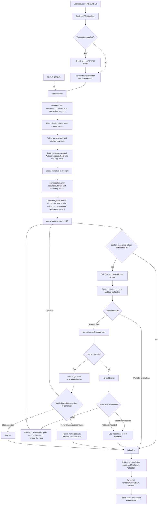
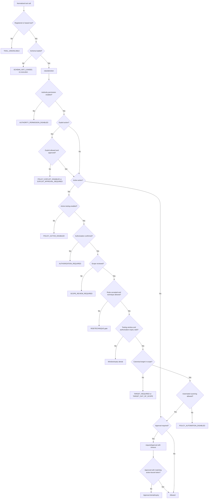
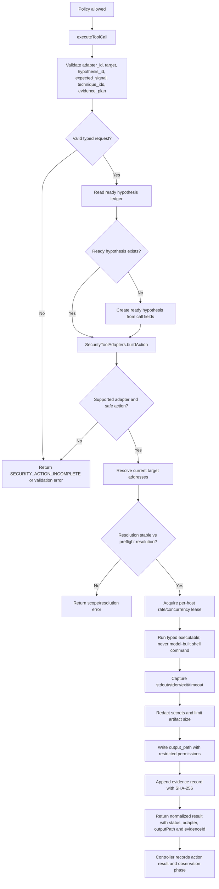
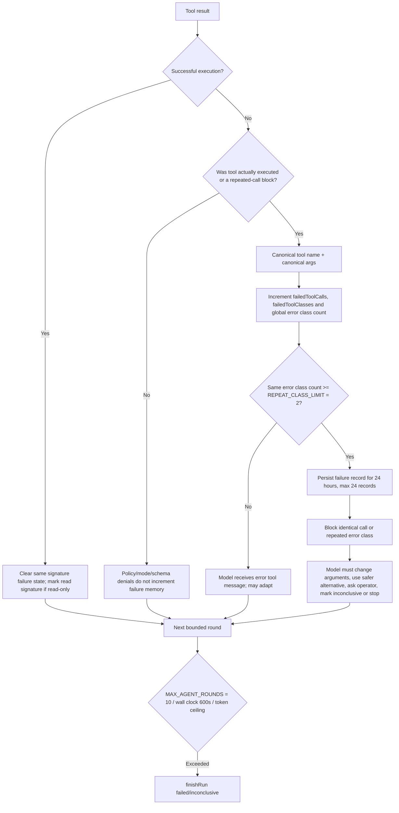
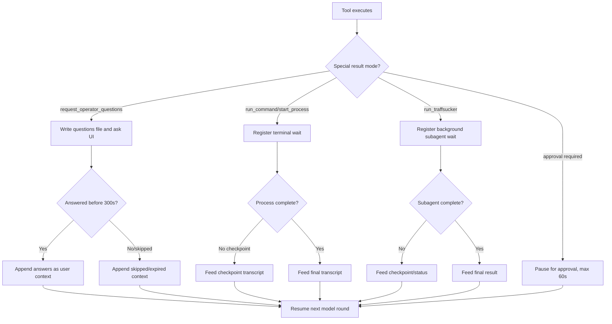
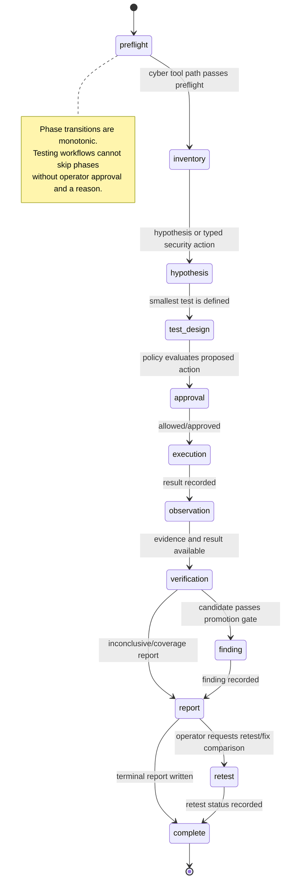
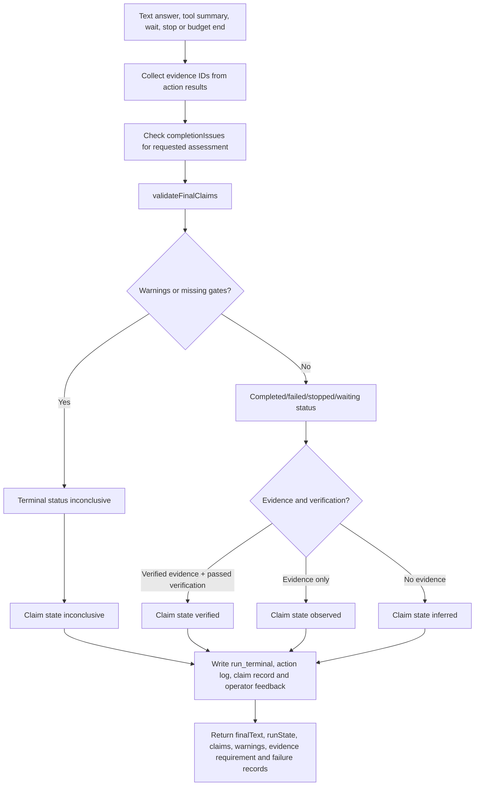

# Current XEKUTE Agent Orchestration Flow

This document describes the current implementation flow for an LLM task in XEKUTE. It focuses on the runtime behavior represented by `src/application/agent/controller.js`, the Electron entry point, the Ollama/OpenRouter stream adapters, the tool catalog/handlers, the policy engine, and the assessment runtime state.

> This is an implementation flowchart, not a product roadmap. A tool may be granted by mode but still be blocked by Authority, scope, RoE, approval, schema, command, or failure-memory guards.

## 1. Complete turn flow



## 2. Model request and outgoing tool-call path

```mermaid
sequenceDiagram
    participant UI as Renderer UI
    participant MAIN as Electron main
    participant C as runAgentTurn
    participant P as Ollama/OpenRouter
    participant G as Grants/Policy
    participant X as Tool executor
    participant H as run_security_tool handler

    UI->>MAIN: agent:run(payload)
    MAIN->>C: runAgentTurn(payload, callbacks)
    C->>C: Normalize profile, route context, grant tools
    C->>C: Build bounded messages and tool schemas
    C->>P: Stream model request with messages + available tools
    P-->>C: thinking/content/tool-call deltas
    C->>C: Merge tool-call fragments and parse arguments
    C->>C: Resolve paths and normalize tool calls
    C->>G: Check mode grant, schema loaded, command and policy
    alt Not granted or policy blocked
        G-->>C: Rejection result; no handler execution
        C-->>P: role=tool error message on next round
    else Approval required
        G-->>UI: action_policy + approval request
        UI-->>G: approved/denied/expired
        G->>G: Re-evaluate action-bound approval token
    else Allowed
        G-->>C: allowed
        C->>X: executeToolCall(toolCall)
        X->>X: Validate schema and normalize arguments
        X->>H: Dispatch run_security_tool(args)
        H->>H: Build typed adapter action
        H->>H: Resolve target and compare DNS resolution
        H->>H: Apply per-target rate lease
        H-->>X: Execute typed executable, persist redacted evidence
        X-->>C: Normalized result
        C-->>P: role=tool result message on next round
    end
    C-->>UI: tool_call/tool_result/run_state/activity events
```

## 3. Preflight and context assembly

```mermaid
flowchart TD
    START[runAgentTurn inputs] --> PROFILE[normalizeProfile(modeFamily, mode)]
    PROFILE --> ROUTE[ContextRouter.routeRequest]
    ROUTE --> TOOLS[filterToolsForMode]
    TOOLS --> NAMES[allowedToolNames]
    NAMES --> HOT[hotToolNamesForProfile]
    HOT --> CATALOG[Agent sees catalog names; full schemas only for hot set]
    ROUTE --> POLICY[loadPolicy]
    POLICY --> FILES[Read project scope/configurations.json, in-scope.json, engagement.json, settings.config]
    POLICY --> FLAGS[Authority permissions, active/scan/exploit gates, target scope, RoE, windows, rate limits]
    ROUTE --> INTENT[Detect edit, plan, target, mutation and discovery requirements]
    INTENT --> BRIEF[Build task brief]
    ROUTE --> DISCOVERY[Optional workspace discovery hints]
    PROFILE --> GUIDANCE[Workspace guidance + cyber library + VAPT library + mode skill]
    GUIDANCE --> SYSTEM[PromptCompiler system context]
    SYSTEM --> CONTEXT[System/project/memory/context messages]
    DISCOVERY --> CONTEXT
    FLAGS --> CONTEXT
    CATALOG --> CONTEXT
    BRIEF --> ROUND[Begin model round]
    CONTEXT --> ROUND
```

## 4. Tool-call parsing, normalization and validation

```mermaid
flowchart TD
    PROVIDER[Ollama NDJSON or OpenRouter SSE] --> DELTA[Incoming message/delta]
    DELTA --> MERGE[Merge tool call fragments by index/id/name]
    MERGE --> TOOL_CALLS[result.toolCalls]
    TOOL_CALLS --> NATIVE{Native calls present?}
    NATIVE -->|No and mutation required| FALLBACK[Parse structured JSON fallback]
    NATIVE -->|Yes| NORMALIZE[ToolMap.normalizeToolCall]
    FALLBACK --> NORMALIZE
    NORMALIZE --> NAME{Known TOOL_META name?}
    NAME -->|No| DROP[Controller filters unknown call]
    NAME -->|Yes| ARG[parseArguments]
    ARG --> ARG_OK{Arguments object?}
    ARG_OK -->|Malformed string| EMPTY[JSON.parse catch returns {}]
    ARG_OK -->|Valid/object| SANITIZE[Sanitize paths, text, command and URLs]
    EMPTY --> SANITIZE
    SANITIZE --> RESOLVE[Resolve target file/path aliases]
    RESOLVE --> GRANTED{Tool name in allowedToolNames?}
    GRANTED -->|No| NOT_GRANTED[NOT_GRANTED/MODE_GUARD; never execute]
    GRANTED -->|Yes| LOADED{Full schema loaded?}
    LOADED -->|No| LOAD_SCHEMA[Return SCHEMA_NOT_LOADED; load for next round]
    LOADED -->|Yes| EXEC_PIPE[Continue to preflight and execution gates]
    EXEC_PIPE --> DISPATCH[createToolHandlers.executeToolCall]
    DISPATCH --> VALIDATE[normalizeIncomingToolCall + validateToolCall]
    VALIDATE --> VALID{Required fields and typed constraints valid?}
    VALID -->|No| VALIDATION_ERROR[Return structured validation error]
    VALID -->|Yes| HANDLER[Dispatch by category and tool name]
```

## 5. Grant, Authority, scope and approval gates



## 6. `run_security_tool` execution path



## 7. Retry, failure memory and repeated-call blocking



## 8. Waiting and human-interaction branches



## 9. Assessment phase machine



## 10. Finalization and claim safety



## Main implementation files

- `src/presentation/electron/main.js` — IPC entry, model qualification, provider round wiring, tool executor wiring.
- `src/application/agent/controller.js` — context assembly, round loop, tool-call normalization, grants, policy/approval orchestration, retries, waits and finalization.
- `src/adapters/llm/ollama/ollama-stream.js` — Ollama NDJSON stream parsing and tool-call fragment merging.
- `src/adapters/llm/openrouter/openrouter-stream.js` — OpenRouter SSE parsing and tool-call fragment merging.
- `src/adapters/tools/core/tool-catalog.js` — tool schemas, mode tool groups, argument parsing and validation.
- `src/adapters/tools/core/tool-handlers.js` — category dispatch and concrete handlers, including `run_security_tool`.
- `src/application/policies/policy-engine.js` — action classification, Authority, scope, RoE, testing-window, automation and approval gates.
- `src/application/agent/runtime.js` — run state, phase transitions, evidence IDs, completion gates and claim validation.
- `src/application/agent/memory/failure-memory.js` — persisted repeated-failure records and expiry.
- `src/application/agent/tunables.js` — round, retry, timeout and failure thresholds.

## Runtime constants that materially affect the flow

- `MAX_AGENT_ROUNDS = 10`
- `TURN_WALL_CLOCK_MS = 600000` (10 minutes)
- `REPEAT_CLASS_LIMIT = 2`
- `FAILURE_MEMORY_TTL_MS = 86400000` (24 hours)
- `MAX_RECORDS = 24` failure records
- `APPROVAL_TIMEOUT_MS = 60000`
- `OPERATOR_QUESTIONS_TIMEOUT_MS = 300000`
- `MAX_EDIT_RETRIES_WITHOUT_TOOLS = 1`
- `MAX_PLAN_RETRIES_WITHOUT_FILE = 3`
- `MAX_VERIFICATION_REMINDERS = 1`
- `MAX_FAILED_VERIFICATION_REMINDERS = 1`
