# Xekute AI-Native VAPT Architecture

```mermaid
flowchart TD

    %% =========================
    %% ENTRY AND HUMAN CONTROL
    %% =========================
    U[Human Security Researcher] --> UI[Xekute IDE]
    UI --> WS[Target Workspace]
    WS --> SCOPE[Scope, Authorization and Safety Policy]

    SCOPE --> ORCH[Xekute Orchestrator]
    ORCH --> APPROVAL{Human approval required?}
    APPROVAL -->|Yes| U
    APPROVAL -->|Approved / Not required| PLAN[Investigation Planner]

    %% =========================
    %% CORE HARNESSES
    %% =========================
    subgraph HARNESS["Xekute Harness Layer"]
        FH[Minimal File Harness<br/>View tree, create, edit, delete]
        TH[Tool-Usage Harness<br/>Validated adapters and sandboxed execution]
        AH[Specialized Agent Harness<br/>TraffSucker, TraffBreaker, TraffNet]
        WH[Web Scraping Harness<br/>Pages, JavaScript, source maps, metadata]
        GH[Web Graphing Harness<br/>Entities, relationships, state transitions]
    end

    PLAN --> FH
    PLAN --> TH
    PLAN --> AH
    PLAN --> WH
    PLAN --> GH

    %% =========================
    %% SPECIALIZED AGENTS
    %% =========================
    subgraph AGENTS["Specialized Security Agents"]
        TS[TraffSucker Agent<br/>Browser exploration and traffic mapping]
        TB[TraffBreaker Agent<br/>Traffic-based VAPT and adaptive testing]
        TN[TraffNet Agent<br/>Network and infrastructure testing]
        EV[Evidence Verifier Agent<br/>Independent confirmation]
    end

    AH --> TS
    AH --> TB
    AH --> TN
    AH --> EV

    %% =========================
    %% EXTERNAL SECURITY TOOLS
    %% =========================
    subgraph TOOLS["Verified Tool Adapters"]
        NMAP[Nmap]
        NUCLEI[Nuclei]
        FFUF[ffuf]
        GOB[Gobuster / DIRB]
        KAT[Katana]
        SQLI[SQLi Tools]
        XSS[XSS Tools]
        PAYLOADS[Curated Payload Repositories]
        CUSTOM[Custom Deterministic Modules]
    end

    TH --> NMAP
    TH --> NUCLEI
    TH --> FFUF
    TH --> GOB
    TH --> KAT
    TH --> SQLI
    TH --> XSS
    TH --> PAYLOADS
    TH --> CUSTOM

    %% =========================
    %% DATA COLLECTION
    %% =========================
    TS --> BROWSER[Real Browser Sessions]
    BROWSER --> TRAFFIC[Captured Requests, Responses and Actions]
    WH --> WEBART[JavaScript, Routes, Forms and Client Logic]
    TN --> NETOBS[Hosts, Ports, Services and Infrastructure Observations]
    TOOLS --> TOOLOUT[Raw Tool Outputs]

    %% =========================
    %% NORMALIZATION AND STORAGE
    %% =========================
    TRAFFIC --> PARSE[Parsers and Normalizers]
    WEBART --> PARSE
    NETOBS --> PARSE
    TOOLOUT --> PARSE

    PARSE --> RAW[(Raw Artifact Store)]
    PARSE --> DB[(Structured Security Database)]
    PARSE --> GRAPH[(Knowledge Graph)]

    RAW -->|On-demand evidence retrieval| RETRIEVE[Context Retriever]
    DB --> RETRIEVE
    GRAPH --> RETRIEVE

    %% =========================
    %% STRUCTURED MEMORY
    %% =========================
    subgraph MEMORY["Structured Investigation Memory"]
        OBS[Observations]
        ENT[Entities<br/>Hosts, endpoints, parameters, accounts, resources]
        REL[Relationships<br/>Creates, consumes, redirects, owns, depends on]
        HYP[Hypothesis Ledger]
        ATT[Attempt History]
        FIND[Candidate and Verified Findings]
    end

    DB --> OBS
    DB --> ENT
    GRAPH --> REL
    GRAPH --> HYP
    DB --> ATT
    DB --> FIND

    OBS --> RETRIEVE
    ENT --> RETRIEVE
    REL --> RETRIEVE
    HYP --> RETRIEVE
    ATT --> RETRIEVE
    FIND --> RETRIEVE

    %% =========================
    %% REASONING LOOP
    %% =========================
    RETRIEVE --> CTX[Task-Specific Context<br/>Only relevant evidence, not all raw logs]
    CTX --> REASON[Reasoning Layer]

    subgraph LOOP["Iterative Security Reasoning Loop"]
        REASON --> GEN[Generate or update hypotheses]
        GEN --> RANK[Rank by evidence, impact, novelty and cost]
        RANK --> NEXT[Choose one bounded next action]
        NEXT --> POLICY{Scope and risk check}
        POLICY -->|Rejected| DENY[Record denial and reason]
        POLICY -->|Allowed| EXEC[Deterministic execution]
        EXEC --> RESULT[Normalize result]
        RESULT --> VERIFY[Independent verification]
        VERIFY --> DECIDE{Confirmed, rejected or uncertain?}
        DECIDE -->|Confirmed| VERIFIED[Create verified finding]
        DECIDE -->|Rejected| REJECTED[Close or downgrade hypothesis]
        DECIDE -->|Uncertain| UPDATE[Update evidence and propose next test]
        UPDATE --> GEN
    end

    DENY --> ATT
    RESULT --> OBS
    EXEC --> ATT
    VERIFIED --> FIND
    REJECTED --> HYP

    %% =========================
    %% AGENT AND TOOL ROUTING
    %% =========================
    NEXT --> ROUTE{Which capability is needed?}

    ROUTE -->|Browser mapping| TS
    ROUTE -->|Web/API testing| TB
    ROUTE -->|Network testing| TN
    ROUTE -->|Specialized CLI tool| TH
    ROUTE -->|Read or modify workspace files| FH
    ROUTE -->|Inspect JavaScript/web assets| WH
    ROUTE -->|Explore relationships or chains| GH

    TB --> EXEC
    TN --> EXEC
    TH --> EXEC
    FH --> EXEC
    WH --> RESULT
    GH --> GRAPH

    %% =========================
    %% CHAINING
    %% =========================
    GRAPH --> PATHS[Candidate Graph Paths]
    PATHS --> CHAIN[Chain Reasoner]
    CHAIN --> CHYP[Multi-step Attack Hypotheses]
    CHYP --> HYP
    CHAIN --> NEXT

    %% =========================
    %% REPORTING AND FEEDBACK
    %% =========================
    VERIFIED --> REPORT[Redacted Evidence Report]
    REPORT --> UI
    UI --> U

    VERIFIED --> LEARN[Feedback and Outcome Memory]
    LEARN --> HYP
    LEARN --> RANK

    %% =========================
    %% SAFETY ENFORCEMENT
    %% =========================
    SCOPE -. enforced on every action .-> POLICY
    SCOPE -. rate, runtime and side-effect budgets .-> EXEC
    SCOPE -. secret and PII controls .-> RAW
    SCOPE -. immutable audit requirements .-> ATT
```



## Core Design Principle

Xekute should never use the model context window as its database.

```text
Raw outputs
    → structured parsing
    → database and knowledge graph
    → task-specific retrieval
    → focused reasoning
    → one bounded action
    → deterministic execution
    → independent verification
    → memory update
```

This keeps the system effective even when tools generate millions of lines of output.
